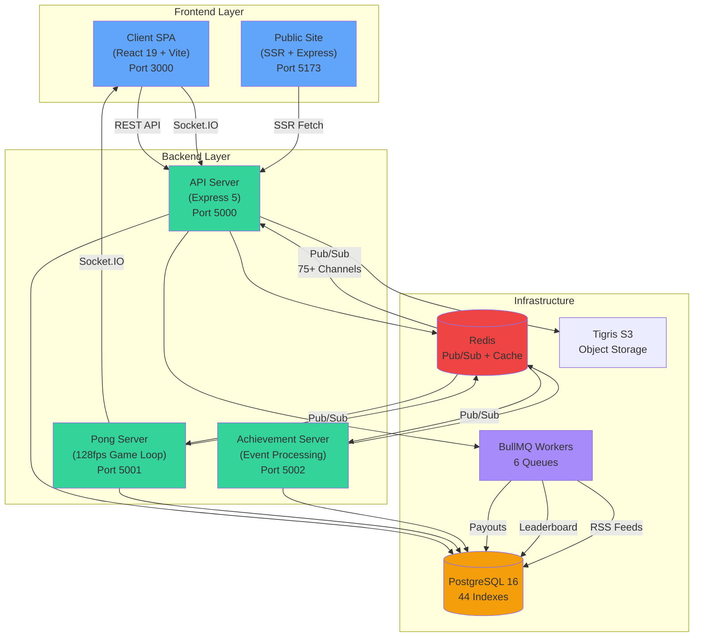

# ElonMuskSucks.net

> Because someone needs to keep score of the world's most interesting billionaire

**ElonMuskSucks.net** is a full-stack TypeScript prediction market platform where users bet on Elon's next move, play Pong for MuskBucks, and track the timeline of chaos. Built with React 19, Socket.IO real-time events, and an unhealthy obsession with technical over-engineering.

**🎮 Live Site:** [https://elonmusksucks.net](https://elonmusksucks.net)

---

## What Is This?

A production-grade prediction market platform featuring:

- 🎯 **Real-time prediction markets** with 6-factor dynamic odds engine
- 🏓 **Multiplayer Pong** with MuskBucks wagering and ELO rankings
- 📰 **Live timeline** of RSS feeds, articles, and tweets
- 🏆 **77 achievements** across 8 categories (including "Tesla Skeptic" and "Rocket Fanboy")
- 💬 **Live chat** and social features with optimistic UI updates
- 👑 **Admin dashboard** for content moderation and analytics

All wrapped in a dual-application architecture (authenticated SPA + server-side rendered public site) served by a unified Express backend with 75+ Socket.IO event channels.

---

## Architecture



**Key Design Decisions:**

- **Dual Frontend**: Authenticated users get a rich SPA experience; public visitors get SEO-optimized SSR pages
- **Microservices (sort of)**: Pong and achievements run as separate Node processes but share the same database
- **EventBusCore**: React 19-optimized event handling with `startTransition` and `useOptimistic` for zero-latency UI
- **Layered Architecture**: Strict separation of Routes → Controllers → Services → Repositories → Prisma

📚 **Deep Dive:** [Architecture Documentation](docs/architecture/overview.md)

---

## Tech Stack

### Frontend
- **React 19** - Concurrent features, `useOptimistic`, `startTransition`
- **Vite 7** - Lightning-fast builds with HMR
- **TypeScript 5.8-5.9** - Strict mode, zero `any` types
- **TailwindCSS 3/4** - Client app uses v4, public site uses v3
- **Socket.IO Client 4.8** - Real-time event subscriptions via EventBusCore

### Backend
- **Node.js ≥24.0.0** - ESM modules, top-level await
- **Express 5** - REST API + SSR rendering
- **Prisma 6.10-6.16** - Type-safe ORM with 44 optimized indexes
- **PostgreSQL 16** - Primary data store with full-text search
- **Socket.IO 4.8** - WebSocket server with Redis adapter
- **Redis (IORedis 5.4-5.8)** - Pub/sub (75+ channels) + caching
- **BullMQ 5.36-5.56** - Background job processing (6 workers)

### Infrastructure
- **Tigris S3** - Object storage for avatars and media
- **SendGrid** - Transactional email (verification, notifications)
- **Fly.io** - Multi-region deployment with Docker
- **GitHub Actions** - CI/CD pipeline

### Development
- **npm Workspaces** - Monorepo with shared types
- **Vitest 3** - Unit and integration testing
- **ESLint 9 + Prettier 3** - Zero-warning policy
- **TypeScript Strict Mode** - All packages share `@ems/types`

---

## Quick Start

### Prerequisites

Ensure you have these installed:

- **Node.js ≥24.0.0** (strict requirement)
- **npm ≥10.0.0**
- **PostgreSQL 16+**
- **Redis 7+**
- **Git**

### Setup (5 minutes)

1. **Clone the repository**
   ```bash
   git clone https://github.com/yourusername/elonmusksucks.git
   cd elonmusksucks
   ```

2. **Install dependencies**
   ```bash
   npm install
   ```

3. **Configure environment variables**
   ```bash
   cp .env.example .env
   # Edit .env with your database credentials, JWT secrets, etc.
   ```

4. **Initialize the database**
   ```bash
   npm run prisma:migrate:dev
   npm run seed:dev
   npm run seed:achievements  # 77 achievements
   ```

5. **Start all services**
   ```bash
   npm run dev
   ```

6. **Verify everything is running**
   - ✅ Client App: http://localhost:3000
   - ✅ API Server: http://localhost:5000/health
   - ✅ Public Site: http://localhost:5173
   - ✅ Pong Server: http://localhost:5001/health
   - ✅ Achievement Server: http://localhost:5002/health

🎉 **You're ready!** Register a new account at `localhost:3000/register` and start betting.

---

## Key Features

### 🎯 Prediction Markets

Create and bet on predictions about Elon's next move:

- **6-Factor Dynamic Odds** - Real-time odds calculation based on bet volume, bettor count, market maturity, category multipliers, and house edge
- **Multiple Market Types** - Binary (Yes/No), Multiple Choice, Over/Under
- **Parlay Betting** - Combine multiple predictions for exponential payouts (up to 10x bonus multiplier)
- **Source Attribution** - Link predictions to articles, tweets, and news sources
- **Live Updates** - Socket.IO events update odds and balances instantly

**Markets include:**
- "Will Elon tweet about crypto today?"
- "Tesla stock price at market close"
- "Days until next SpaceX launch"
- "Number of tweets this week (over/under)"

📖 [Prediction Engine Docs](apps/server/README.md#prediction-service)

---

### 🏓 Multiplayer Pong

Bet MuskBucks and compete for ELO supremacy:

- **128fps Game Loop** - Server-authoritative physics with 7.8ms tick rate
- **Client-Authoritative Paddles** - Zero-latency controls with server validation
- **MuskBucks Wagering** - Secure escrow system with configurable bet limits
- **ELO Rating System** - Skill-based matchmaking (K-factor 32)
- **AI Opponents** - 4 difficulty levels (Easy, Medium, Hard, Impossible)
- **Spectator Mode** - Watch live matches with real-time game state
- **Mobile Controls** - Touch-optimized for mobile browsers

**Wager Limits by Difficulty:**
- Easy AI: 10-100 MuskBucks
- Medium AI: 50-500 MuskBucks
- Hard AI: 100-1,000 MuskBucks
- Impossible AI: 250-2,500 MuskBucks
- PVP: 10-10,000 MuskBucks

📖 [Pong Server Architecture](apps/pong-server/README.md)

---

### 📰 Content Timeline

Stay updated with the latest Elon news:

- **RSS Feed Integration** - Automated fetching from 20+ sources via BullMQ workers
- **Admin Moderation Queue** - Bulk approve/reject with keyboard shortcuts
- **Auto-Tagging System** - Rule-based categorization (Tesla, SpaceX, Legal, Controversy, etc.)
- **Infinite Scroll** - Virtualized list rendering for performance
- **OPML Import/Export** - Manage feed subscriptions
- **Public SSR Timeline** - SEO-optimized server-rendered timeline at `/timeline`

**Feed Categories:**
- 📰 News (Reuters, Bloomberg, WSJ)
- 🐦 Twitter (via RSS bridges)
- 📺 YouTube (SpaceX launches, Tesla reviews)
- 💼 Financial (SEC filings, stock analysis)

📖 [Timeline Architecture](apps/client/README.md#timeline-context)

---

### 🏆 Achievement System

77 achievements across 8 categories:

- **Betting Achievements** - "First Blood" (first bet), "High Roller" (10k+ wager), "Perfect Week" (7-day streak)
- **Pong Achievements** - "Pong Prodigy" (first win), "Undefeated" (10-win streak), "ELO Elite" (1800+ rating)
- **Financial Achievements** - "Millionaire" (1M balance), "Bankruptcy" (negative balance), "Diamond Hands" (hold 100k+ for 30 days)
- **Social Achievements** - "Influencer" (100 followers), "Conversationalist" (1000 messages), "Viral" (post liked 100+ times)
- **Prediction Achievements** - "Oracle" (10 correct predictions), "Contrarian" (win underdog bet), "Market Maker" (create 50 predictions)
- **Streak Achievements** - Daily login streaks, betting streaks, winning streaks
- **Special Achievements** - Easter eggs and hidden unlocks

**Real-time Unlocking:**
- Instant Socket.IO notifications when achievements are earned
- Achievement progress tracking in profile
- Rarity tiers (Common, Rare, Epic, Legendary)

📖 [Achievement Server Docs](apps/achievement-server/README.md)

---

### 💬 Social Features

Connect with other users:

- **Live Global Chat** - Socket.IO-powered chat with real-time message delivery
- **User Profiles** - Stats, betting history, achievements, ELO rating
- **Performance Graphs** - Balance over time, win rate trends, category preferences
- **Follow System** - Track favorite users and their bets
- **Activity Feed** - Real-time stream of bets, achievements, and posts
- **Reactions** - Like, bookmark, and share content

📖 [Social Features Docs](apps/client/README.md#chat-context)

---

### 👑 Admin Dashboard

Comprehensive admin tools:

- **User Management** - Ban users, adjust balances, view detailed analytics
- **Content Moderation** - Approve/reject timeline articles with bulk actions
- **System Monitoring** - Event system metrics, Socket.IO health, queue status
- **Financial Oversight** - Transaction tracking, volume analytics, payout verification
- **Feed Management** - Add/remove RSS sources, configure auto-tagging rules
- **Database Tools** - Run migrations, seed data, backup/restore

**Admin Capabilities:**
- Create admin-only predictions
- Resolve prediction markets early
- Override automated payout calculations
- View real-time user sessions and Socket.IO connections

📖 [Admin Features](apps/client/README.md#admin-components)

---

## Project Structure

```
elonmusksucks/
├── apps/
│   ├── client/              # React 19 SPA (Port 3000)
│   │   ├── src/
│   │   │   ├── components/  # 75+ React components
│   │   │   ├── contexts/    # 16 React contexts
│   │   │   ├── hooks/       # 30+ custom hooks
│   │   │   └── utils/       # Helper functions
│   │   └── README.md        # Client architecture docs
│   │
│   ├── server/              # Express API (Port 5000)
│   │   ├── src/
│   │   │   ├── routes/      # Express route definitions
│   │   │   ├── controllers/ # Request handlers (16 controllers)
│   │   │   ├── services/    # Business logic (32+ services)
│   │   │   ├── repositories/# Data access (22 repositories)
│   │   │   ├── handlers/    # Socket.IO event handlers (11)
│   │   │   ├── workers/     # BullMQ background jobs (6)
│   │   │   └── middleware/  # Auth, error handling, etc.
│   │   └── README.md        # Server architecture docs
│   │
│   ├── public-site/         # SSR Marketing Site (Port 5173)
│   │   ├── src/
│   │   │   ├── components/  # SSR components
│   │   │   ├── entry-server.tsx  # SSR entry point
│   │   │   └── entry-client.tsx  # Hydration entry
│   │   └── README.md        # SSR architecture docs
│   │
│   ├── pong-server/         # Pong Game Server (Port 5001)
│   │   ├── src/
│   │   │   ├── game/        # Physics engine, collision detection
│   │   │   ├── ai/          # AI opponent logic
│   │   │   └── handlers/    # Socket.IO game event handlers
│   │   └── README.md        # Game server docs
│   │
│   └── achievement-server/  # Achievement Service (Port 5002)
│       ├── src/
│       │   ├── engine/      # Achievement processing logic
│       │   ├── handlers/    # Redis event subscribers
│       │   └── repositories/# Achievement data access
│       └── README.md        # Achievement server docs
│
├── packages/
│   └── types/              # Shared TypeScript types
│       ├── api/            # API request/response types
│       ├── database/       # Prisma-generated types
│       └── config/         # Configuration types
│
├── prisma/
│   ├── schema.prisma       # Database schema (20+ models)
│   ├── migrations/         # Migration history
│   └── seed/              # Database seeders
│
├── docs/
│   ├── architecture/       # System architecture docs
│   │   ├── overview.md
│   │   ├── design-patterns.md
│   │   ├── real-time-events.md
│   │   └── room-authorization.md
│   │
│   ├── guides/            # How-to guides
│   │   ├── deployment.md
│   │   ├── security-checklist.md
│   │   ├── ip-banning.md
│   │   └── redis-migration.md
│   │
│   └── dev/              # Development notes
│       └── performance-issues/
│
├── scripts/              # Deployment & utility scripts
│   ├── deploy-all.sh
│   └── backup-db.sh
│
├── CLAUDE.md             # AI assistant context & instructions
├── CONTRIBUTING.md       # Contribution guidelines
└── README.md            # This file
```

### Application Documentation

Each application has comprehensive developer-focused documentation:

- 📱 **[Client App](apps/client/README.md)** - React 19 architecture, EventBusCore, contexts, hooks, components
- 🖥️ **[API Server](apps/server/README.md)** - Layered architecture, services, repositories, workers, Socket.IO handlers
- 🌐 **[Public Site](apps/public-site/README.md)** - SSR architecture, theme system, data fetching, SEO optimization
- 🏓 **[Pong Server](apps/pong-server/README.md)** - Game loop, physics engine, AI system, wagering, ELO ratings
- 🏆 **[Achievement Server](apps/achievement-server/README.md)** - Event-driven architecture, achievement engine, Redis handlers

---

## Documentation

### Architecture Documentation

- **[System Overview](docs/architecture/overview.md)** - High-level architecture, tech stack, deployment topology
- **[Design Patterns](docs/architecture/design-patterns.md)** - Layered architecture, EventBusCore, repository pattern, state management
- **[Real-time Events](docs/architecture/real-time-events.md)** - Socket.IO architecture, 75+ Redis channels, EventBusCore implementation
- **[Room Authorization](docs/architecture/room-authorization.md)** - Socket.IO room security, user isolation, admin access

### Deployment & Operations

- **[Deployment Guide](docs/guides/deployment.md)** - Fly.io deployment, Docker multi-stage builds, environment configuration
- **[Security Checklist](docs/guides/security-checklist.md)** - Pre-launch security audit, JWT configuration, input validation
- **[IP Banning](docs/guides/ip-banning.md)** - Rate limiting, ban management, Redis-based tracking
- **[Redis Migration](docs/guides/redis-migration.md)** - Upstash → Fly.io Redis migration process

### Development

- **[CLAUDE.md](CLAUDE.md)** - AI assistant context and project instructions
- **[CONTRIBUTING.md](CONTRIBUTING.md)** - Contribution guidelines, code standards, Git workflow
- **[Performance Analysis](docs/dev/performance-issues/SUMMARY.md)** - Performance optimization notes and solutions

---

## Development Commands

### Common Commands

```bash
# Start all services (client, server, public-site, pong, achievement, workers)
npm run dev

# Type checking (all apps)
npm run tsc

# Linting & formatting
npm run lint              # ESLint (zero-warning policy)
npm run format            # Prettier

# Run all tests
npm test

# Build all apps for production
npm run build
```

### Database Commands

```bash
# Generate Prisma client after schema changes
npm run prisma:generate

# Reset database and apply all migrations
npm run prisma:migrate:dev

# Seed development data
npm run seed:dev

# Seed achievements (77 achievements)
npm run seed:achievements

# Open Prisma Studio (database GUI)
npm run prisma:studio
```

### Workspace-Specific Commands

```bash
# Client app
npm -w apps/client run dev           # Dev server (port 3000)
npm -w apps/client run build         # Production build
npm -w apps/client run test          # Vitest tests

# Server
npm -w apps/server run dev           # Express with hot reload (port 5000)
npm -w apps/server run build         # TypeScript compilation
npm -w apps/server run worker        # Start all 6 BullMQ workers

# Public site (SSR)
npm -w apps/public-site run dev      # SSR dev server (port 5173)
npm -w apps/public-site run build    # SSR production build

# Pong server
npm -w apps/pong-server run dev      # Pong server with hot reload (port 5001)
npm -w apps/pong-server run build    # TypeScript compilation

# Achievement server
npm -w apps/achievement-server run dev      # Achievement service (port 5002)
npm -w apps/achievement-server run build    # TypeScript compilation
```

📖 **Full command reference:** [CLAUDE.md - Common Commands](CLAUDE.md#common-commands)

---

## Contributing

We welcome contributions from the community! Whether it's bug fixes, new features, or documentation improvements.

### Quick Contribution Workflow

1. **Fork the repository**
2. **Create a feature branch**: `git checkout -b feat/amazing-feature`
3. **Make your changes** following our code standards
4. **Run tests & linting**: `npm test && npm run lint`
5. **Commit with conventional commits**: `git commit -m "feat(scope): add amazing feature"`
6. **Push to your fork**: `git push origin feat/amazing-feature`
7. **Open a Pull Request**

### Code Standards

- ✅ **TypeScript strict mode** - No `any` types allowed
- ✅ **ESLint zero-warning policy** - All warnings must be fixed
- ✅ **Layered architecture** - Routes → Controllers → Services → Repositories → Prisma
- ✅ **No enums in shared types** - Use `as const` objects with type extraction
- ✅ **EventBusCore for Socket.IO** - No direct `socket.on()` calls in components
- ✅ **Comprehensive tests** - Unit tests for services, integration tests for APIs

### Development Rules

**DO ✅:**
- Use shared types from `@ems/types` package
- Follow layered architecture pattern strictly
- Subscribe to events via EventBusCore in React components
- Use `startTransition` for non-critical UI updates
- Implement optimistic updates for user actions
- Add tests for all new business logic

**DON'T ❌:**
- Use Prisma directly in routes/controllers/services (repositories only)
- Use direct Socket.IO/Redis in routes/controllers (inject via dependency)
- Add schema libraries (zod, yup, valibot) - use TypeScript types
- Use `socket.on()` directly in components - use EventBusCore
- Recreate types locally - import from `@ems/types`
- Skip TypeScript strict mode checks

📖 **Full contribution guide:** [CONTRIBUTING.md](CONTRIBUTING.md)

---

## Deployment

### Fly.io Deployment (Recommended)

The platform is optimized for Fly.io with multi-region support and sticky sessions:

```bash
# Deploy server
cd apps/server
fly deploy

# Deploy client (static assets via server)
cd apps/client
npm run build
# Assets served by Express in production

# Deploy public site (SSR)
cd apps/public-site
fly deploy

# Deploy pong server
cd apps/pong-server
fly deploy

# Deploy achievement server
cd apps/achievement-server
fly deploy
```

### Docker Deployment

All apps include production-ready multi-stage Dockerfiles:

```bash
# Build server image
docker build -t elonmusksucks-server -f apps/server/Dockerfile .

# Run with environment variables
docker run -p 5000:5000 --env-file .env elonmusksucks-server

# Build all services with docker-compose
docker-compose up -d
```

### Production Checklist

Before deploying to production:

- [ ] Set secure JWT secrets (32+ characters, randomly generated)
- [ ] Configure PostgreSQL with connection pooling (PgBouncer recommended)
- [ ] Set up Redis cluster or managed Redis for high availability
- [ ] Enable sticky sessions in load balancer (required for Socket.IO)
- [ ] Configure CORS for production domains only
- [ ] Set `NODE_ENV=production` environment variable
- [ ] Enable compression middleware in Express
- [ ] Set up database backups (automated daily snapshots)
- [ ] Configure monitoring and alerts (CPU, memory, database connections)
- [ ] Review security checklist for JWT, bcrypt, rate limiting

📖 **Detailed deployment guide:** [docs/guides/deployment.md](docs/guides/deployment.md)

---

## Testing

### Running Tests

```bash
# Run all tests (Vitest)
npm test

# Run tests for specific app
npm -w apps/server test
npm -w apps/client test

# Run tests in watch mode
npm test -- --watch

# Generate coverage report
npm test -- --coverage
```

### Test Structure

```
apps/
├── server/
│   └── src/
│       ├── services/
│       │   └── __tests__/
│       │       ├── betting.service.test.ts
│       │       ├── prediction.service.test.ts
│       │       └── user.service.test.ts
│       ├── controllers/
│       │   └── __tests__/
│       └── repositories/
│           └── __tests__/
└── client/
    └── src/
        ├── components/
        │   └── __tests__/
        ├── hooks/
        │   └── __tests__/
        └── utils/
            └── __tests__/
```

**Test Coverage Goals:**
- Services: 80%+ coverage (business logic)
- Controllers: 70%+ coverage (request handling)
- Utilities: 90%+ coverage (pure functions)
- Components: 60%+ coverage (UI logic)

---

## Troubleshooting

### Common Issues

#### Socket.IO not connecting

```bash
# Check server is running
curl http://localhost:5000/health

# Check Redis connection
redis-cli ping

# Enable Socket.IO debug logging in browser console
localStorage.debug = 'socket.io-client:*'
```

#### Database connection errors

```bash
# Verify PostgreSQL is running
psql -U postgres -d elonmusksucks

# Run migrations
npm run prisma:migrate:dev

# Reset database (WARNING: deletes all data)
npm run prisma:migrate:reset
```

#### Port conflicts

```bash
# Kill processes on required ports
lsof -ti:3000,5000,5001,5002,5173 | xargs kill -9

# Or use the cleanup script
npm run cleanup
```

#### Type errors after schema changes

```bash
# Regenerate Prisma client and TypeScript types
npm run prisma:generate

# Rebuild all apps
npm run build
```

#### Redis connection failures

```bash
# Check Redis is running
redis-cli ping

# Start Redis (macOS)
brew services start redis

# Start Redis (Linux)
sudo systemctl start redis

# Check Redis connection in Node
redis-cli -h localhost -p 6379
```

---

## License

This project is licensed under the **MIT License**.

---

## Built With

- [React 19](https://react.dev/) - UI framework with concurrent features
- [Node.js](https://nodejs.org/) - JavaScript runtime
- [TypeScript](https://www.typescriptlang.org/) - Type safety and developer experience
- [Express](https://expressjs.com/) - Minimalist web framework
- [Socket.IO](https://socket.io/) - Real-time bidirectional communication
- [Prisma](https://www.prisma.io/) - Next-generation ORM
- [PostgreSQL](https://www.postgresql.org/) - Advanced open-source database
- [Redis](https://redis.io/) - In-memory data structure store
- [TailwindCSS](https://tailwindcss.com/) - Utility-first CSS framework
- [Vite](https://vitejs.dev/) - Next-generation frontend tooling
- [BullMQ](https://docs.bullmq.io/) - Premium message queue
- [Fly.io](https://fly.io/) - Global application platform

---

## Support

Need help or want to report an issue?

- 💬 **GitHub Discussions** - Ask questions and share ideas
- 🐛 **GitHub Issues** - Report bugs and request features
- 📧 **Email** - support@elonmusksucks.net

---

**Made with ❤️ (and a healthy dose of sarcasm) by the ElonMuskSucks.net team**

*Remember: Past prediction performance does not guarantee future Elon-related chaos*
