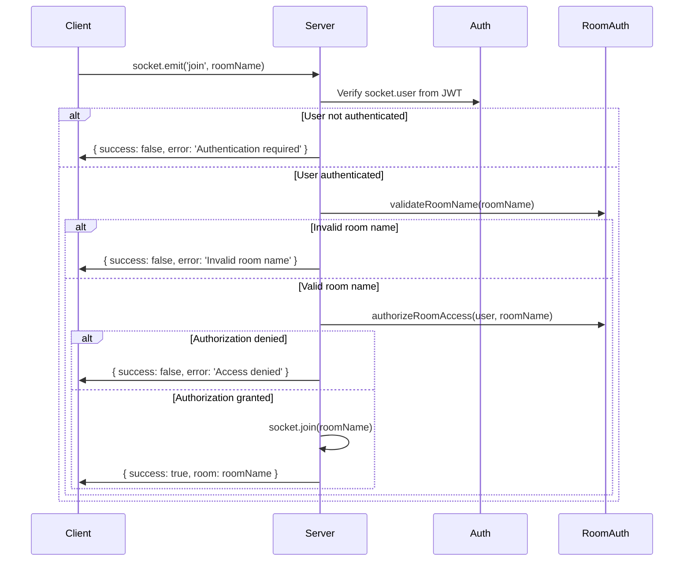

# Room Authorization System

## Overview

The Socket.IO room authorization system provides secure, role-based access control for real-time communication channels. All room access is validated server-side to prevent unauthorized access to sensitive data streams.

## Room Types & Access Patterns

### 🌐 Public Rooms

**Accessible to all authenticated users**

```typescript
const PUBLIC_ROOMS = [
  'predictions', // General prediction market updates
  'betting', // Betting system events
  'leaderboard', // General leaderboard updates
  'achievements', // Achievement unlocks and progress
  'chat', // Global chat room
  'timeline', // Public timeline/news feed
  'leaderboard:daily', // Daily leaderboard rankings
  'leaderboard:allTime', // All-time leaderboard rankings
  'stats:global', // Platform-wide statistics
  'pong:lobby', // Pong game lobby
  'pong:matches', // Pong match spectating
];
```

**Requirements:**

- Must be authenticated (valid JWT token)
- No additional role requirements

### 👤 User-Specific Rooms

**Only accessible by the specific user (or admins)**

| Pattern                  | Example             | Purpose                            |
| ------------------------ | ------------------- | ---------------------------------- |
| `user:{userId}`          | `user:123`          | Personal notifications and updates |
| `stats:user:{userId}`    | `stats:user:123`    | Individual user statistics         |
| `activity:user:{userId}` | `activity:user:123` | Personal activity streams          |
| `pong:user:{userId}`     | `pong:user:123`     | User's Pong statistics and matches |

**Authorization Logic:**

```typescript
// User can access their own room
if (requestedUserId === user.id) return { authorized: true };

// Admins can access any user room
if (user.role === 'ADMIN') return { authorized: true };

// Otherwise denied
return { authorized: false, reason: "Cannot access another user's private room" };
```

### 🛡️ Admin-Only Rooms

**Restricted to users with ADMIN role**

```typescript
const ADMIN_ROOMS = [
  'admin', // General admin communications
  'admin:metrics', // System performance metrics
  'admin:moderation', // Moderation actions and alerts
  'admin:feeds', // RSS feed management
  'admin:events', // Admin event notifications
];
```

**Requirements:**

- Must be authenticated
- Must have `role: 'ADMIN'`

### 🎮 Game-Specific Rooms

**Context-dependent access control**

| Pattern                     | Example             | Access Rules                        |
| --------------------------- | ------------------- | ----------------------------------- |
| `pong:game:{gameId}`        | `pong:game:abc123`  | Any authenticated user (spectating) |
| `prediction:{predictionId}` | `prediction:456`    | Any authenticated user              |
| `chat:room:{roomId}`        | `chat:room:general` | Any authenticated user              |

## API Contracts

### Join Room Event

**Client → Server**

```typescript
// Both event names supported for backward compatibility
socket.emit('join', roomName, callback?);
socket.emit('joinRoom', roomName, callback?);
```

**Server Response**

```typescript
// Success
callback({ success: true, room: string });

// Failure
callback({
  success: false,
  error: string, // Human-readable error message
});
```

**Example Usage**

```typescript
// Client-side room joining with error handling
socket.emit('join', 'user:123', (response) => {
  if (response.success) {
    console.log(`Joined room: ${response.room}`);
  } else {
    console.error(`Failed to join room: ${response.error}`);
  }
});
```

### Leave Room Event

**Client → Server**

```typescript
socket.emit('leave', roomName, callback?);
socket.emit('leaveRoom', roomName, callback?);
```

**Server Response**

```typescript
callback({ success: true, room: string });
```

### Room Debug (Development Only)

**Client → Server**

```typescript
socket.emit('rooms', callback);
```

**Server Response**

```typescript
callback(rooms: string[]); // Array of current room memberships
```

## Authorization Flow



## Security Features

### 🔍 Room Name Validation

- **Length Limit**: Maximum 100 characters
- **Character Whitelist**: `[a-zA-Z0-9:._-]` only
- **Reserved Names**: Blocks `__proto__`, `constructor`, `prototype`
- **Injection Prevention**: Regex validation prevents malicious inputs

### 🛡️ Access Control

- **Authentication Required**: All rooms require valid JWT token
- **Role-Based Access**: Admin vs. user permissions
- **User Isolation**: Users cannot access other users' private rooms
- **Pattern Matching**: Secure regex patterns for dynamic room names

### 📊 Monitoring & Logging

- **Access Attempts**: All authorization failures are logged
- **User Tracking**: Socket ID and user ID logged for room operations
- **Development Debug**: Room membership debugging in development mode

## Error Handling

### Common Error Messages

| Error                                       | Cause                                      | Resolution                  |
| ------------------------------------------- | ------------------------------------------ | --------------------------- |
| `Authentication required`                   | No valid JWT token                         | Authenticate user           |
| `Admin access required`                     | User not admin trying to access admin room | Verify admin role           |
| `Cannot access another user's private room` | User trying to access wrong user's room    | Use correct user ID         |
| `Room name contains invalid characters`     | Invalid characters in room name            | Use only allowed characters |
| `Room name too long (max 100 characters)`   | Room name exceeds limit                    | Shorten room name           |
| `Unknown room pattern: {roomName}`          | Room doesn't match any pattern             | Use valid room pattern      |

### Client-Side Error Handling

```typescript
import { useRoomLifecycle } from './hooks/useRoomLifecycle';

// Automatic room management with error handling
const Dashboard = () => {
  const { user } = useAuth();

  // Hook handles authorization failures gracefully
  useRoomLifecycle([
    `user:${user.id}`,      // Personal notifications
    'leaderboard:daily',    // Public leaderboard
    'chat'                  // Global chat
  ]);

  return <div>Dashboard content</div>;
};
```

## Implementation Notes

### Server-Side Integration

```typescript
// Room handlers are registered in socket.ts
import { registerRoomHandlers } from './handlers/roomHandlers';

// Applied to each socket connection
io.on('connection', (socket) => {
  registerRoomHandlers(io, socket);
  // ... other handlers
});
```

### Client-Side Integration

```typescript
// useRoomLifecycle hook provides automatic room management
import { useRoomLifecycle } from '../hooks/useRoomLifecycle';

// Automatically joins rooms on mount, leaves on unmount
// Handles reconnection and authorization failures
const Component = () => {
  useRoomLifecycle(['room1', 'room2']);
  return <div>Component with real-time updates</div>;
};
```

### Automatic User Rooms

```typescript
// Server automatically joins users to their personal rooms
io.on('connection', (socket) => {
  const user = socket.user;

  // Personal room for user-specific events
  if (user?.id) {
    socket.join(`user:${user.id}`);
  }

  // Admin room for admin users
  if (user?.role === 'ADMIN') {
    socket.join('admin');
  }
});
```

## Migration Notes

### Backward Compatibility

- Supports both `join`/`leave` and `joinRoom`/`leaveRoom` events
- Existing client code continues to work
- Server responses include success/error feedback

### Breaking Changes

- **None**: Authorization is additive security layer
- **Enhanced**: Server now validates all room access attempts
- **Improved**: Better error messages and logging

## Testing Authorization

### Manual Testing

```bash
# Development mode - check room membership
# Open browser console and run:
socket.emit('rooms', (rooms) => console.log('Current rooms:', rooms));

# Test unauthorized access
socket.emit('join', 'admin', (response) => {
  console.log('Admin room access:', response);
  // Should fail for non-admin users
});
```

### Automated Testing

```typescript
// Test room authorization in integration tests
describe('Room Authorization', () => {
  it('should deny admin room access to regular users', async () => {
    const response = await socket.emitWithAck('join', 'admin');
    expect(response.success).toBe(false);
    expect(response.error).toContain('Admin access required');
  });

  it('should allow user to join their own room', async () => {
    const response = await socket.emitWithAck('join', `user:${userId}`);
    expect(response.success).toBe(true);
  });
});
```

## Performance Considerations

### Room Validation Caching

- Pattern matching is performed on every room join
- Consider caching validation results for repeated patterns
- Monitor performance impact in high-traffic scenarios

### Memory Management

- Room membership is automatically cleaned up on disconnect
- No persistent storage of room memberships
- Socket.IO handles room cleanup internally

### Monitoring Metrics

- Track authorization failure rates
- Monitor room join/leave frequency
- Alert on unusual access patterns

---

**Security Note**: This authorization system provides defense-in-depth security. Always validate permissions on the server-side for any data sent to rooms, as this system controls room membership but not individual message authorization.
