# System Architecture & Feature Flow Diagrams

A comprehensive visual guide to the ElonMuskSucks.net platform architecture, covering all systems, data flows, and user interactions across the dual-application ecosystem.

## Table of Contents

1. [High-Level System Architecture](#high-level-system-architecture)
2. [Dual-Application Architecture](#dual-application-architecture)
3. [Authentication & Security System](#authentication--security-system)
4. [Theme System Architecture](#theme-system-architecture)
5. [Real-time Communication System](#real-time-communication-system)
6. [Prediction Market Engine](#prediction-market-engine)
7. [Pong Game System](#pong-game-system)
8. [Content & Timeline System](#content--timeline-system)
9. [Admin & Moderation System](#admin--moderation-system)
10. [Data Flow & Persistence](#data-flow--persistence)
11. [Background Job System](#background-job-system)
12. [User Experience Flows](#user-experience-flows)

---

## High-Level System Architecture

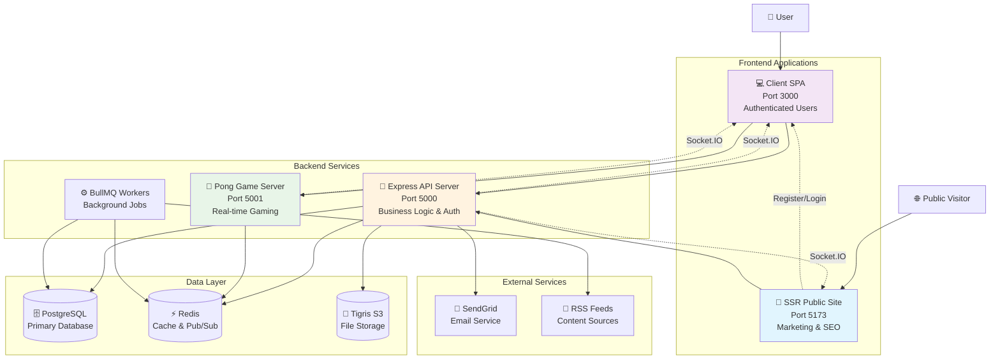
```mermaid
graph TB
    %% User Entry Points
    User[👤 User]
    PublicVisitor[🌐 Public Visitor]
    
    %% Frontend Applications
    subgraph "Frontend Applications"
        PublicSite[📄 SSR Public Site<br/>Port 5173<br/>Marketing & SEO]
        ClientApp[💻 Client SPA<br/>Port 3000<br/>Authenticated Users]
    end
    
    %% Backend Services
    subgraph "Backend Services"
        APIServer[🔌 Express API Server<br/>Port 5000<br/>Business Logic & Auth]
        PongServer[🏓 Pong Game Server<br/>Port 5001<br/>Real-time Gaming]
        Workers[⚙️ BullMQ Workers<br/>Background Jobs]
    end
    
    %% Data Layer
    subgraph "Data Layer"
        PostgreSQL[(🗄️ PostgreSQL<br/>Primary Database)]
        Redis[(⚡ Redis<br/>Cache & Pub/Sub)]
        TigrisS3[(📁 Tigris S3<br/>File Storage)]
    end
    
    %% External Services
    subgraph "External Services"
        SendGrid[📧 SendGrid<br/>Email Service]
        RSSFeeds[📰 RSS Feeds<br/>Content Sources]
    end
    
    %% User Interactions
    PublicVisitor --> PublicSite
    User --> ClientApp
    PublicSite -.->|Register/Login| ClientApp
    
    %% Frontend to Backend
    PublicSite --> APIServer
    ClientApp --> APIServer
    ClientApp --> PongServer
    
    %% Backend to Data
    APIServer --> PostgreSQL
    APIServer --> Redis
    APIServer --> TigrisS3
    PongServer --> Redis
    Workers --> PostgreSQL
    Workers --> Redis
    
    %% External Integrations
    APIServer --> SendGrid
    Workers --> RSSFeeds
    
    %% Real-time Connections
    APIServer -.->|Socket.IO| ClientApp
    APIServer -.->|Socket.IO| PublicSite
    PongServer -.->|Socket.IO| ClientApp
    
    style PublicSite fill:#e1f5fe
    style ClientApp fill:#f3e5f5
    style APIServer fill:#fff3e0
    style PongServer fill:#e8f5e8
```

**Architecture Overview:**
- **Dual Frontend**: SSR public site for marketing + SPA client for authenticated users
- **Microservices Backend**: Main API server + dedicated Pong game server
- **Real-time Communication**: Socket.IO connections across all applications
- **Scalable Data**: PostgreSQL for persistence, Redis for caching/pub-sub
- **External Integrations**: Email service, RSS feeds, S3-compatible storage

---

## Dual-Application Architecture

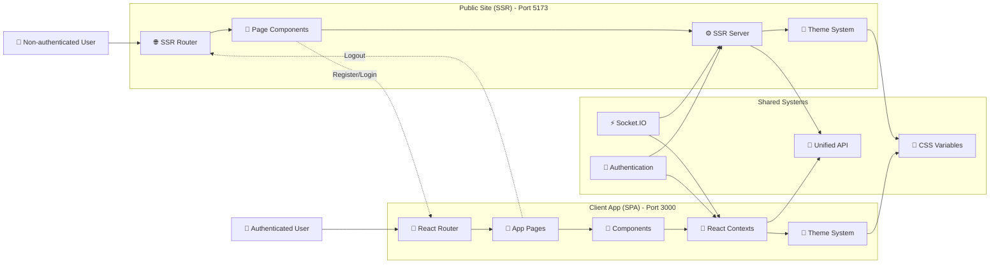
```mermaid
graph LR
    %% Public Site Architecture
    subgraph "Public Site (SSR) - Port 5173"
        PSRouter[🌐 SSR Router]
        PSPages[📄 Page Components]
        PSServer[⚙️ SSR Server]
        PSTheme[🎨 Theme System]
        
        PSRouter --> PSPages
        PSPages --> PSServer
        PSServer --> PSTheme
    end
    
    %% Client App Architecture  
    subgraph "Client App (SPA) - Port 3000"
        CARouter[🔀 React Router]
        CAPages[📱 App Pages]
        CAComponents[🧩 Components]
        CAContexts[🔄 React Contexts]
        CATheme[🎨 Theme System]
        
        CARouter --> CAPages
        CAPages --> CAComponents
        CAComponents --> CAContexts
        CAContexts --> CATheme
    end
    
    %% Shared Systems
    subgraph "Shared Systems"
        API[🔌 Unified API]
        Auth[🔐 Authentication]
        SharedTheme[🎨 CSS Variables]
        SocketIO[⚡ Socket.IO]
    end
    
    %% User Flow
    NonAuthUser[👤 Non-authenticated User] --> PSRouter
    AuthUser[🔑 Authenticated User] --> CARouter
    
    %% Cross-app Navigation
    PSPages -.->|Register/Login| CARouter
    CAPages -.->|Logout| PSRouter
    
    %% Backend Integration
    PSServer --> API
    CAContexts --> API
    
    %% Real-time Updates
    SocketIO --> CAContexts
    SocketIO --> PSServer
    
    %% Shared Theme
    PSTheme --> SharedTheme
    CATheme --> SharedTheme
    
    %% Authentication Flow
    Auth --> CAContexts
    Auth --> PSServer
```

**Key Features:**
- **SSR Public Site**: SEO-optimized marketing pages with server-side rendering
- **SPA Client App**: Rich interactive application for authenticated users
- **Seamless Authentication**: Users flow between public marketing and private app
- **Unified Theme System**: Consistent styling across both applications
- **Shared Backend**: Single API serves both frontend applications

---

## Authentication & Security System

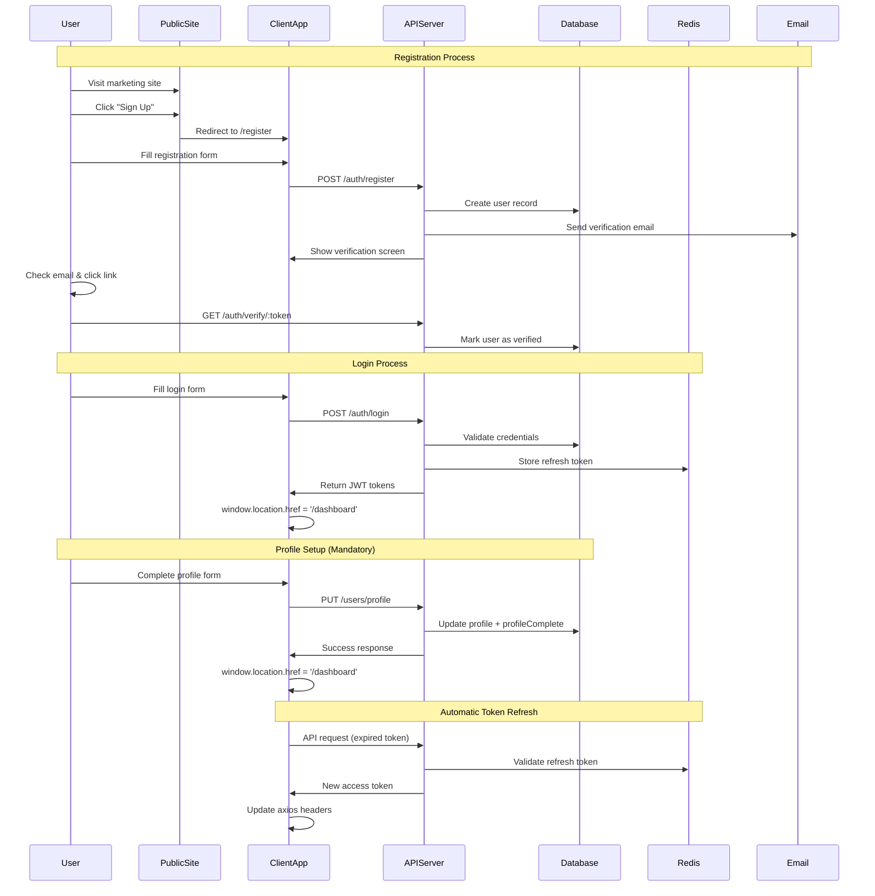
```mermaid
sequenceDiagram
    participant User
    participant PublicSite
    participant ClientApp
    participant APIServer
    participant Database
    participant Redis
    participant Email
    
    %% Registration Flow
    Note over User, Email: Registration Process
    User->>PublicSite: Visit marketing site
    User->>PublicSite: Click "Sign Up"
    PublicSite->>ClientApp: Redirect to /register
    
    User->>ClientApp: Fill registration form
    ClientApp->>APIServer: POST /auth/register
    APIServer->>Database: Create user record
    APIServer->>Email: Send verification email
    APIServer->>ClientApp: Show verification screen
    
    User->>User: Check email & click link
    User->>APIServer: GET /auth/verify/:token
    APIServer->>Database: Mark user as verified
    
    %% Login Flow
    Note over User, Redis: Login Process
    User->>ClientApp: Fill login form
    ClientApp->>APIServer: POST /auth/login
    APIServer->>Database: Validate credentials
    APIServer->>Redis: Store refresh token
    APIServer->>ClientApp: Return JWT tokens
    ClientApp->>ClientApp: window.location.href = '/dashboard'
    
    %% Profile Setup
    Note over User, Database: Profile Setup (Mandatory)
    User->>ClientApp: Complete profile form
    ClientApp->>APIServer: PUT /users/profile
    APIServer->>Database: Update profile + profileComplete
    APIServer->>ClientApp: Success response
    ClientApp->>ClientApp: window.location.href = '/dashboard'
    
    %% Token Refresh
    Note over ClientApp, Redis: Automatic Token Refresh
    ClientApp->>APIServer: API request (expired token)
    APIServer->>Redis: Validate refresh token
    APIServer->>ClientApp: New access token
    ClientApp->>ClientApp: Update axios headers
```

**Security Features:**
- **JWT Tokens**: Access + refresh token pattern with automatic rotation
- **Email Verification**: Mandatory email verification before login
- **Full Page Refresh**: Ensures proper state initialization after auth changes
- **Session Management**: Redis-stored refresh tokens with expiration
- **Profile Completion**: Mandatory setup flow for new users
- **Token Interceptors**: Automatic token refresh with axios interceptors

---

## Theme System Architecture

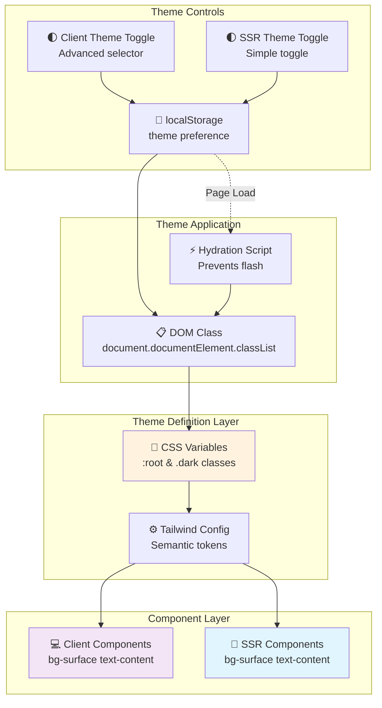
```mermaid
graph TD
    %% Theme Definition
    subgraph "Theme Definition Layer"
        CSSVars[🎨 CSS Variables<br/>:root & .dark classes]
        TailwindConfig[⚙️ Tailwind Config<br/>Semantic tokens]
    end
    
    %% Component Usage
    subgraph "Component Layer"
        ClientComponents[💻 Client Components<br/>bg-surface text-content]
        SSRComponents[📄 SSR Components<br/>bg-surface text-content]
    end
    
    %% Theme Controls
    subgraph "Theme Controls"
        ClientToggle[🌓 Client Theme Toggle<br/>Advanced selector]
        SSRToggle[🌓 SSR Theme Toggle<br/>Simple toggle]
        LocalStorage[💾 localStorage<br/>theme preference]
    end
    
    %% Theme Application
    subgraph "Theme Application"
        DOMClass[📋 DOM Class<br/>document.documentElement.classList]
        ThemeHydration[⚡ Hydration Script<br/>Prevents flash]
    end
    
    %% Flow
    CSSVars --> TailwindConfig
    TailwindConfig --> ClientComponents
    TailwindConfig --> SSRComponents
    
    ClientToggle --> LocalStorage
    SSRToggle --> LocalStorage
    LocalStorage --> DOMClass
    DOMClass --> CSSVars
    
    ThemeHydration --> DOMClass
    
    %% Theme Persistence
    LocalStorage -.->|Page Load| ThemeHydration
    
    style CSSVars fill:#fff3e0
    style ClientComponents fill:#f3e5f5
    style SSRComponents fill:#e1f5fe
```

**Theme Flow Explanation:**
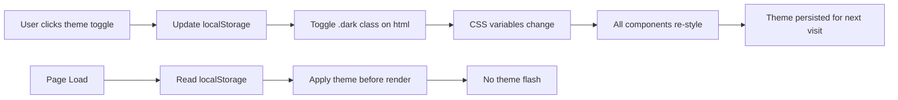
```mermaid
flowchart LR
    A[User clicks theme toggle] --> B[Update localStorage]
    B --> C[Toggle .dark class on html]
    C --> D[CSS variables change]
    D --> E[All components re-style]
    E --> F[Theme persisted for next visit]
    
    G[Page Load] --> H[Read localStorage]
    H --> I[Apply theme before render]
    I --> J[No theme flash]
```

**Theme Features:**
- **CSS Variables**: Semantic color tokens shared across applications
- **Default Dark Mode**: Both apps start in dark theme
- **Flash Prevention**: Theme applied before hydration/render
- **Persistent Storage**: localStorage saves user preference
- **Consistent Styling**: Identical theming across SSR and SPA

---

## Real-time Communication System

```mermaid
graph TB
    %% Client Connections
    subgraph "Client Connections"
        ClientApp[💻 Client App<br/>Socket.IO Client]
        PublicSite[📄 Public Site<br/>Socket.IO Client]
        PongClient[🏓 Pong Client<br/>Dedicated Connection]
    end
    
    %% Server Infrastructure
    subgraph "Server Infrastructure"
        MainSocket[🔌 Main Socket.IO Server<br/>Port 5000]
        PongSocket[🏓 Pong Socket.IO Server<br/>Port 5001]
        RedisAdapter[⚡ Redis Adapter<br/>Cross-server sync]
    end
    
    %% Event Categories
    subgraph "Real-time Events"
        PredictionEvents[🎯 Prediction Events<br/>betPlaced, marketUpdate]
        ChatEvents[💬 Chat Events<br/>message, userJoin/Leave]
        ActivityEvents[📊 Activity Events<br/>userActivity, leaderboard]
        PongEvents[🏓 Pong Events<br/>gameStart, paddleMove, score]
        AdminEvents[👑 Admin Events<br/>moderation, systemStats]
    end
    
    %% Data Sources
    subgraph "Data Sources"
        Database[(🗄️ PostgreSQL<br/>Event data)]
        RedisCache[(⚡ Redis<br/>Pub/Sub channel)]
        GameState[🎮 Game State<br/>In-memory)]
    end
    
    %% Connection Flow
    ClientApp --> MainSocket
    PublicSite --> MainSocket
    PongClient --> PongSocket
    
    %% Server Coordination
    MainSocket --> RedisAdapter
    PongSocket --> RedisAdapter
    RedisAdapter --> RedisCache
    
    %% Event Distribution
    MainSocket --> PredictionEvents
    MainSocket --> ChatEvents
    MainSocket --> ActivityEvents
    MainSocket --> AdminEvents
    PongSocket --> PongEvents
    
    %% Data Integration
    PredictionEvents --> Database
    ActivityEvents --> Database
    ChatEvents --> RedisCache
    PongEvents --> GameState
    AdminEvents --> Database
```

**Socket Event Categories:**
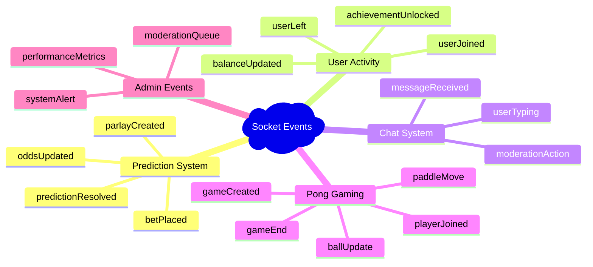
```mermaid
mindmap
  root)Socket Events(
    Prediction System
      betPlaced
      predictionResolved
      oddsUpdated
      parlayCreated
    User Activity
      userJoined
      userLeft
      balanceUpdated
      achievementUnlocked
    Chat System
      messageReceived
      userTyping
      moderationAction
    Pong Gaming
      gameCreated
      playerJoined
      paddleMove
      ballUpdate
      gameEnd
    Admin Events
      systemAlert
      moderationQueue
      performanceMetrics
```

**Real-time Features:**
- **21+ Event Types**: Comprehensive coverage of all platform features
- **Cross-server Sync**: Redis adapter enables horizontal scaling
- **Dedicated Pong Server**: Optimized for low-latency gaming
- **Event Acknowledgments**: Critical events use ACK pattern for reliability
- **Room-based Targeting**: Events sent only to relevant users

---

## Prediction Market Engine

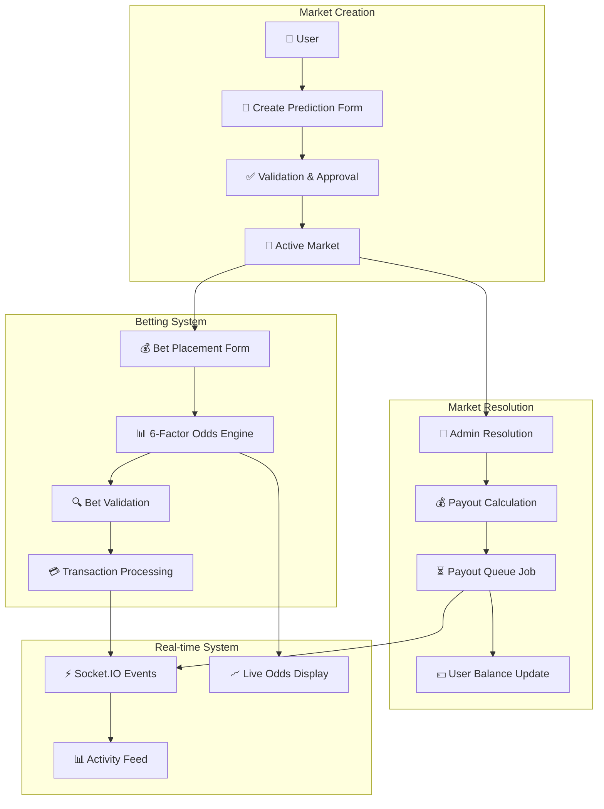
```mermaid
graph TD
    %% Market Creation
    subgraph "Market Creation"
        User[👤 User]
        CreateForm[📝 Create Prediction Form]
        Validation[✅ Validation & Approval]
        MarketActive[🎯 Active Market]
    end
    
    %% Betting System
    subgraph "Betting System"
        BetForm[💰 Bet Placement Form]
        OddsEngine[📊 6-Factor Odds Engine]
        BetValidation[🔍 Bet Validation]
        Transaction[💳 Transaction Processing]
    end
    
    %% Market Resolution
    subgraph "Market Resolution"
        AdminResolve[👑 Admin Resolution]
        PayoutCalc[💰 Payout Calculation]
        PayoutQueue[⏳ Payout Queue Job]
        UserPayout[💵 User Balance Update]
    end
    
    %% Real-time Updates
    subgraph "Real-time System"
        SocketEvents[⚡ Socket.IO Events]
        ActivityFeed[📊 Activity Feed]
        LiveOdds[📈 Live Odds Display]
    end
    
    %% Data Flow
    User --> CreateForm
    CreateForm --> Validation
    Validation --> MarketActive
    
    MarketActive --> BetForm
    BetForm --> OddsEngine
    OddsEngine --> BetValidation
    BetValidation --> Transaction
    
    MarketActive --> AdminResolve
    AdminResolve --> PayoutCalc
    PayoutCalc --> PayoutQueue
    PayoutQueue --> UserPayout
    
    %% Real-time Integration
    Transaction --> SocketEvents
    PayoutQueue --> SocketEvents
    OddsEngine --> LiveOdds
    SocketEvents --> ActivityFeed
```

**Odds Calculation Engine:**
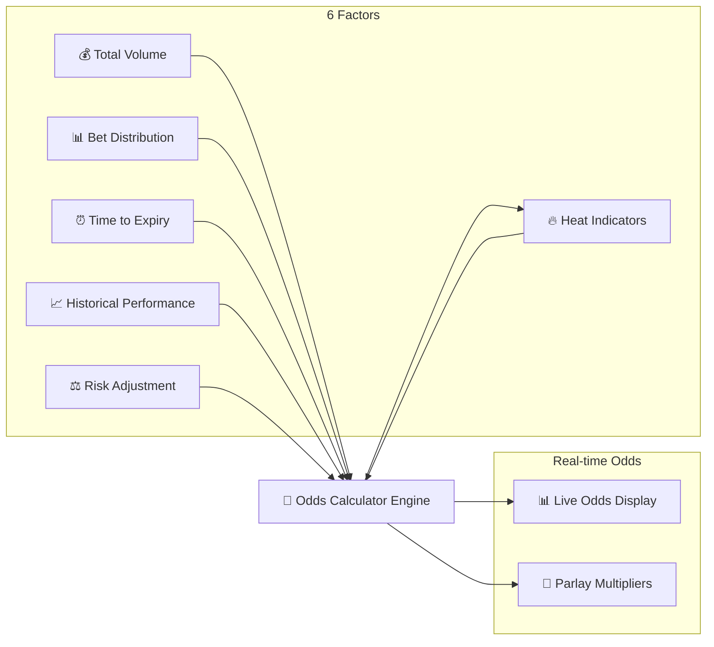
```mermaid
graph LR
    %% Input Factors
    subgraph "6 Factors"
        TotalVolume[💰 Total Volume]
        BetDistribution[📊 Bet Distribution]
        TimeToExpiry[⏰ Time to Expiry]
        MarketHeat[🔥 Market Activity]
        HistoricalData[📈 Historical Performance]
        RiskAdjustment[⚖️ Risk Adjustment]
    end
    
    %% Processing
    OddsCalculator[🧮 Odds Calculator Engine]
    
    %% Output
    subgraph "Real-time Odds"
        LiveOdds[📊 Live Odds Display]
        ParlayMultiplier[🎯 Parlay Multipliers]
        MarketHeat[🔥 Heat Indicators]
    end
    
    %% Flow
    TotalVolume --> OddsCalculator
    BetDistribution --> OddsCalculator
    TimeToExpiry --> OddsCalculator
    MarketHeat --> OddsCalculator
    HistoricalData --> OddsCalculator
    RiskAdjustment --> OddsCalculator
    
    OddsCalculator --> LiveOdds
    OddsCalculator --> ParlayMultiplier
    OddsCalculator --> MarketHeat
```

**Market Features:**
- **Multi-option Predictions**: Complex betting markets with multiple outcomes
- **Dynamic Odds**: Real-time calculation based on 6 factors
- **Parlay System**: Combine multiple predictions with bonus multipliers
- **Source Integration**: Link articles/tweets as prediction evidence
- **Automated Resolution**: Background jobs process payouts

---

## Pong Game System

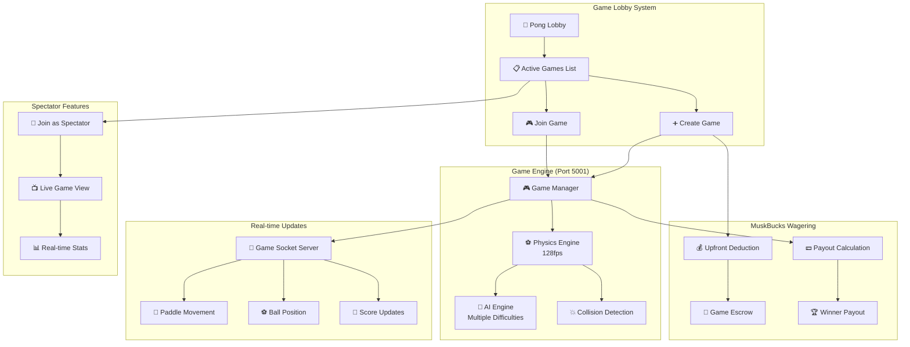
```mermaid
graph TD
    %% Game Lobby
    subgraph "Game Lobby System"
        PongLobby[🏓 Pong Lobby]
        GamesList[📋 Active Games List]
        CreateGame[➕ Create Game]
        JoinGame[🎮 Join Game]
    end
    
    %% Game Engine
    subgraph "Game Engine (Port 5001)"
        GameManager[🎮 Game Manager]
        PhysicsEngine[⚽ Physics Engine<br/>128fps]
        AIEngine[🤖 AI Engine<br/>Multiple Difficulties]
        CollisionDetection[💥 Collision Detection]
    end
    
    %% Real-time Communication
    subgraph "Real-time Updates"
        GameSocket[🔌 Game Socket Server]
        PaddleEvents[🏓 Paddle Movement]
        BallUpdates[⚽ Ball Position]
        ScoreEvents[🎯 Score Updates]
    end
    
    %% Wagering System
    subgraph "MuskBucks Wagering"
        WagerDeduction[💰 Upfront Deduction]
        GameEscrow[🏦 Game Escrow]
        PayoutCalculation[💵 Payout Calculation]
        WinnerPayout[🏆 Winner Payout]
    end
    
    %% Spectator System
    subgraph "Spectator Features"
        SpectatorJoin[👥 Join as Spectator]
        LiveGameView[📺 Live Game View]
        GameStats[📊 Real-time Stats]
    end
    
    %% Flow
    PongLobby --> GamesList
    GamesList --> CreateGame
    GamesList --> JoinGame
    CreateGame --> GameManager
    JoinGame --> GameManager
    
    GameManager --> PhysicsEngine
    PhysicsEngine --> AIEngine
    PhysicsEngine --> CollisionDetection
    
    GameManager --> GameSocket
    GameSocket --> PaddleEvents
    GameSocket --> BallUpdates
    GameSocket --> ScoreEvents
    
    CreateGame --> WagerDeduction
    WagerDeduction --> GameEscrow
    GameManager --> PayoutCalculation
    PayoutCalculation --> WinnerPayout
    
    GamesList --> SpectatorJoin
    SpectatorJoin --> LiveGameView
    LiveGameView --> GameStats
```

**Pong Game Architecture:**
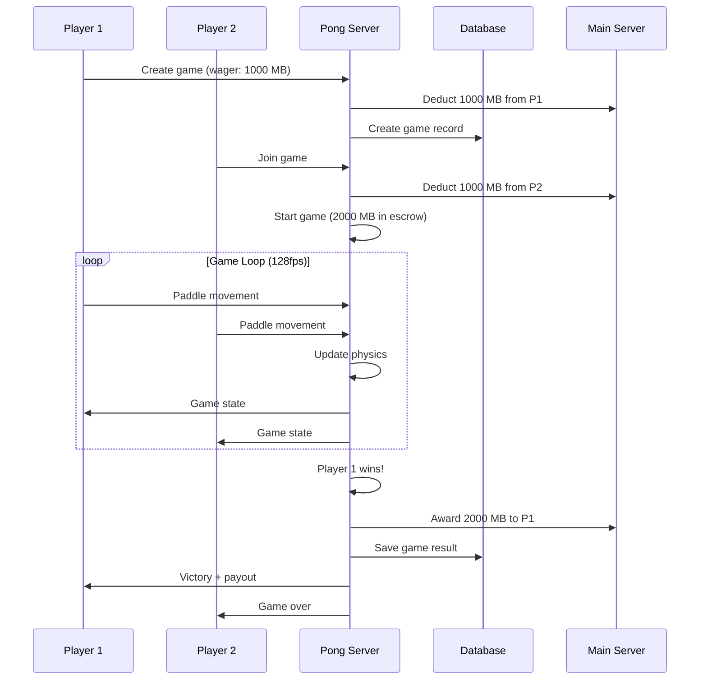
```mermaid
sequenceDiagram
    participant P1 as Player 1
    participant P2 as Player 2
    participant PongServer as Pong Server
    participant Database as Database
    participant MainServer as Main Server
    
    %% Game Creation
    P1->>PongServer: Create game (wager: 1000 MB)
    PongServer->>MainServer: Deduct 1000 MB from P1
    PongServer->>Database: Create game record
    
    %% Player Join
    P2->>PongServer: Join game
    PongServer->>MainServer: Deduct 1000 MB from P2
    PongServer->>PongServer: Start game (2000 MB in escrow)
    
    %% Real-time Gameplay
    loop Game Loop (128fps)
        P1->>PongServer: Paddle movement
        P2->>PongServer: Paddle movement
        PongServer->>PongServer: Update physics
        PongServer->>P1: Game state
        PongServer->>P2: Game state
    end
    
    %% Game End
    PongServer->>PongServer: Player 1 wins!
    PongServer->>MainServer: Award 2000 MB to P1
    PongServer->>Database: Save game result
    PongServer->>P1: Victory + payout
    PongServer->>P2: Game over
```

**Pong Features:**
- **Real-time Multiplayer**: Low-latency gameplay with 128fps physics
- **MuskBucks Wagering**: Secure escrow system with automatic payouts
- **AI Opponents**: Multiple difficulty levels for solo play
- **Spectator Mode**: Watch live games with real-time updates
- **Mobile Support**: Touch controls with responsive canvas
- **ELO Rating System**: Skill-based matchmaking and rankings

---

## Content & Timeline System

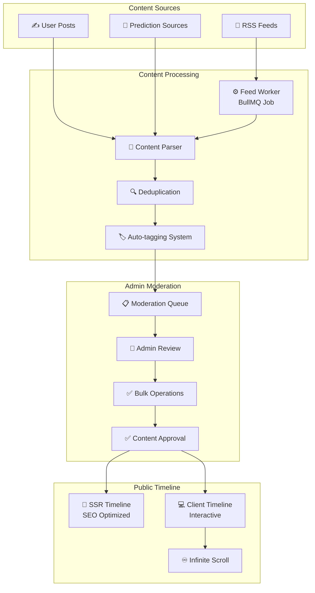
```mermaid
graph TD
    %% Content Sources
    subgraph "Content Sources"
        RSSFeeds[📰 RSS Feeds]
        UserPosts[✍️ User Posts]
        PredictionSources[🔗 Prediction Sources]
    end
    
    %% Content Ingestion
    subgraph "Content Processing"
        FeedWorker[⚙️ Feed Worker<br/>BullMQ Job]
        ContentParser[📝 Content Parser]
        Deduplication[🔍 Deduplication]
        AutoTagging[🏷️ Auto-tagging System]
    end
    
    %% Moderation System
    subgraph "Admin Moderation"
        ModerationQueue[📋 Moderation Queue]
        AdminReview[👑 Admin Review]
        BulkApproval[✅ Bulk Operations]
        ContentApproval[✅ Content Approval]
    end
    
    %% Public Display
    subgraph "Public Timeline"
        SSRTimeline[📄 SSR Timeline<br/>SEO Optimized]
        ClientTimeline[💻 Client Timeline<br/>Interactive]
        InfiniteScroll[♾️ Infinite Scroll]
    end
    
    %% Content Flow
    RSSFeeds --> FeedWorker
    UserPosts --> ContentParser
    PredictionSources --> ContentParser
    
    FeedWorker --> ContentParser
    ContentParser --> Deduplication
    Deduplication --> AutoTagging
    AutoTagging --> ModerationQueue
    
    ModerationQueue --> AdminReview
    AdminReview --> BulkApproval
    BulkApproval --> ContentApproval
    
    ContentApproval --> SSRTimeline
    ContentApproval --> ClientTimeline
    ClientTimeline --> InfiniteScroll
```

**Auto-tagging System:**
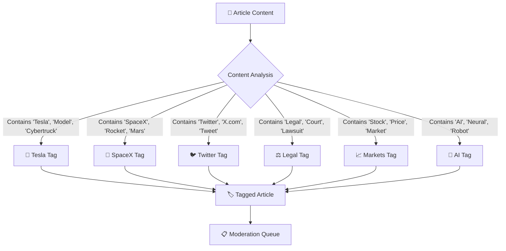
```mermaid
flowchart TD
    A[📰 Article Content] --> B{Content Analysis}
    
    B -->|Contains 'Tesla', 'Model', 'Cybertruck'| C[🚗 Tesla Tag]
    B -->|Contains 'SpaceX', 'Rocket', 'Mars'| D[🚀 SpaceX Tag]
    B -->|Contains 'Twitter', 'X.com', 'Tweet'| E[🐦 Twitter Tag]
    B -->|Contains 'Legal', 'Court', 'Lawsuit'| F[⚖️ Legal Tag]
    B -->|Contains 'Stock', 'Price', 'Market'| G[📈 Markets Tag]
    B -->|Contains 'AI', 'Neural', 'Robot'| H[🤖 AI Tag]
    
    C --> I[🏷️ Tagged Article]
    D --> I
    E --> I
    F --> I
    G --> I
    H --> I
    
    I --> J[📋 Moderation Queue]
```

**Content Features:**
- **RSS Feed Ingestion**: Automated fetching with BullMQ workers
- **Content Deduplication**: Prevents duplicate articles
- **Auto-tagging**: Rule-based categorization system
- **Admin Moderation**: Bulk approval/rejection interface
- **SEO-Optimized Timeline**: Server-side rendered for search engines
- **OPML Support**: Import/export feed subscriptions

---

## Admin & Moderation System

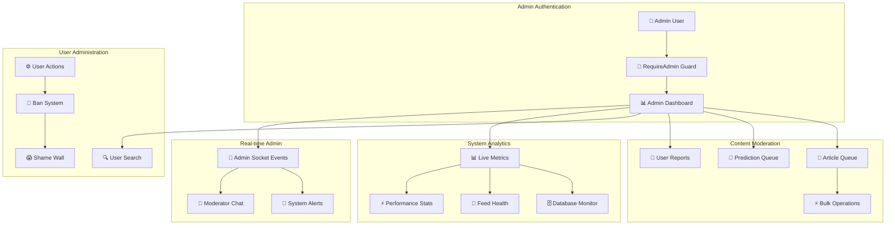
```mermaid
graph TB
    %% Admin Access
    subgraph "Admin Authentication"
        AdminUser[👑 Admin User]
        AdminGuard[🔐 RequireAdmin Guard]
        AdminDashboard[📊 Admin Dashboard]
    end
    
    %% Moderation Tools
    subgraph "Content Moderation"
        ArticleQueue[📰 Article Queue]
        PredictionQueue[🎯 Prediction Queue]
        UserReports[🚨 User Reports]
        BulkActions[⚡ Bulk Operations]
    end
    
    %% User Management
    subgraph "User Administration"
        UserSearch[🔍 User Search]
        UserActions[⚙️ User Actions]
        BanSystem[🚫 Ban System]
        ShameWall[😱 Shame Wall]
    end
    
    %% System Monitoring
    subgraph "System Analytics"
        LiveMetrics[📊 Live Metrics]
        DatabaseMonitor[🗄️ Database Monitor]
        FeedHealth[📰 Feed Health]
        PerformanceStats[⚡ Performance Stats]
    end
    
    %% Real-time Admin Features
    subgraph "Real-time Admin"
        AdminSocket[🔌 Admin Socket Events]
        SystemAlerts[🚨 System Alerts]
        ModeratorChat[💬 Moderator Chat]
    end
    
    %% Access Control
    AdminUser --> AdminGuard
    AdminGuard --> AdminDashboard
    
    %% Dashboard Functions
    AdminDashboard --> ArticleQueue
    AdminDashboard --> PredictionQueue
    AdminDashboard --> UserReports
    AdminDashboard --> UserSearch
    AdminDashboard --> LiveMetrics
    
    %% Moderation Actions
    ArticleQueue --> BulkActions
    UserActions --> BanSystem
    BanSystem --> ShameWall
    
    %% System Monitoring
    LiveMetrics --> DatabaseMonitor
    LiveMetrics --> FeedHealth
    LiveMetrics --> PerformanceStats
    
    %% Real-time Updates
    AdminDashboard --> AdminSocket
    AdminSocket --> SystemAlerts
    AdminSocket --> ModeratorChat
```

**Admin Dashboard Components:**
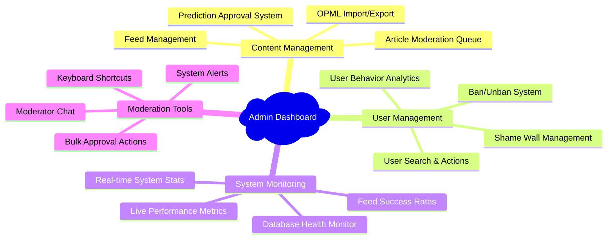
```mermaid
mindmap
  root)Admin Dashboard(
    Content Management
      Article Moderation Queue
      Prediction Approval System
      Feed Management
      OPML Import/Export
    User Management  
      User Search & Actions
      Ban/Unban System
      Shame Wall Management
      User Behavior Analytics
    System Monitoring
      Live Performance Metrics
      Database Health Monitor
      Feed Success Rates
      Real-time System Stats
    Moderation Tools
      Bulk Approval Actions
      Keyboard Shortcuts
      Moderator Chat
      System Alerts
```

**Admin Features:**
- **Role-based Access**: Admin-only dashboard with authentication guards
- **Content Moderation**: Bulk approve/reject articles and predictions
- **User Management**: Search, ban, and moderate user accounts
- **System Monitoring**: Real-time performance and health metrics
- **Shame Wall**: Public display of banned users with reasons

---

## Data Flow & Persistence

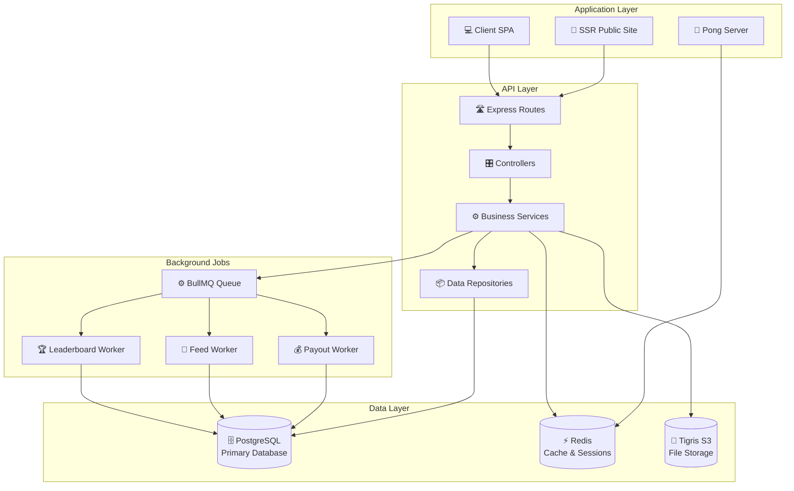
```mermaid
graph TD
    %% Application Layer
    subgraph "Application Layer"
        PublicSite[📄 SSR Public Site]
        ClientApp[💻 Client SPA]
        PongServer[🏓 Pong Server]
    end
    
    %% API Layer
    subgraph "API Layer"
        Routes[🛣️ Express Routes]
        Controllers[🎛️ Controllers]
        Services[⚙️ Business Services]
        Repositories[📦 Data Repositories]
    end
    
    %% Data Persistence
    subgraph "Data Layer"
        PostgreSQL[(🗄️ PostgreSQL<br/>Primary Database)]
        Redis[(⚡ Redis<br/>Cache & Sessions)]
        TigrisS3[(📁 Tigris S3<br/>File Storage)]
    end
    
    %% Background Processing
    subgraph "Background Jobs"
        BullMQ[⚙️ BullMQ Queue]
        PayoutWorker[💰 Payout Worker]
        FeedWorker[📰 Feed Worker]
        LeaderboardWorker[🏆 Leaderboard Worker]
    end
    
    %% Data Flow
    PublicSite --> Routes
    ClientApp --> Routes
    PongServer --> Redis
    
    Routes --> Controllers
    Controllers --> Services
    Services --> Repositories
    Repositories --> PostgreSQL
    
    Services --> Redis
    Services --> TigrisS3
    
    %% Background Processing
    Services --> BullMQ
    BullMQ --> PayoutWorker
    BullMQ --> FeedWorker
    BullMQ --> LeaderboardWorker
    
    PayoutWorker --> PostgreSQL
    FeedWorker --> PostgreSQL
    LeaderboardWorker --> PostgreSQL
```

**Database Schema Overview:**
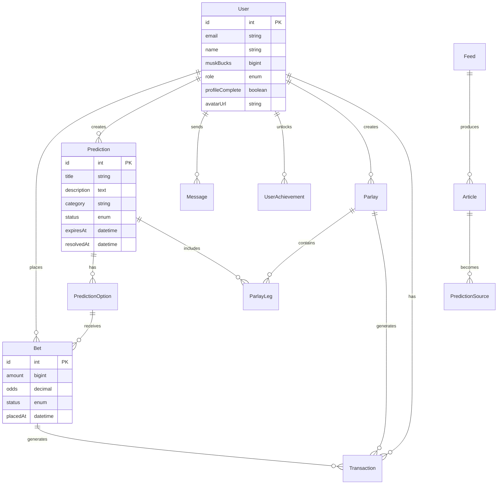
```mermaid
erDiagram
    User ||--o{ Bet : places
    User ||--o{ Prediction : creates
    User ||--o{ Message : sends
    User ||--o{ UserAchievement : unlocks
    
    Prediction ||--o{ PredictionOption : has
    PredictionOption ||--o{ Bet : receives
    
    Prediction ||--o{ ParlayLeg : includes
    Parlay ||--o{ ParlayLeg : contains
    User ||--o{ Parlay : creates
    
    User ||--o{ Transaction : has
    Bet ||--o{ Transaction : generates
    Parlay ||--o{ Transaction : generates
    
    Feed ||--o{ Article : produces
    Article ||--o{ PredictionSource : becomes
    
    User {
        id int PK
        email string
        name string
        muskBucks bigint
        role enum
        profileComplete boolean
        avatarUrl string
    }
    
    Prediction {
        id int PK
        title string
        description text
        category string
        status enum
        expiresAt datetime
        resolvedAt datetime
    }
    
    Bet {
        id int PK
        amount bigint
        odds decimal
        status enum
        placedAt datetime
    }
```

**Data Features:**
- **44 Database Indexes**: Optimized query performance
- **BigInt Precision**: Unlimited monetary precision
- **Transaction Safety**: All money operations in Prisma transactions
- **Redis Caching**: Session storage and pub/sub messaging
- **File Storage**: S3-compatible object storage for images

---

## Background Job System

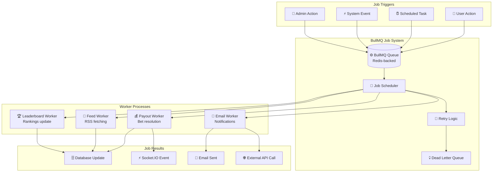
```mermaid
graph TD
    %% Job Triggers
    subgraph "Job Triggers"
        UserAction[👤 User Action]
        ScheduledTask[⏰ Scheduled Task]
        SystemEvent[⚡ System Event]
        AdminAction[👑 Admin Action]
    end
    
    %% Job Queue System
    subgraph "BullMQ Job System"
        JobQueue[(⚙️ BullMQ Queue<br/>Redis-backed)]
        JobScheduler[📅 Job Scheduler]
        JobRetry[🔄 Retry Logic]
        JobDLQ[💀 Dead Letter Queue]
    end
    
    %% Worker Processes
    subgraph "Worker Processes"
        PayoutWorker[💰 Payout Worker<br/>Bet resolution]
        FeedWorker[📰 Feed Worker<br/>RSS fetching]
        LeaderboardWorker[🏆 Leaderboard Worker<br/>Rankings update]
        EmailWorker[📧 Email Worker<br/>Notifications]
    end
    
    %% Job Outcomes
    subgraph "Job Results"
        DatabaseUpdate[🗄️ Database Update]
        SocketEmission[⚡ Socket.IO Event]
        EmailSent[📧 Email Sent]
        ExternalAPI[🌐 External API Call]
    end
    
    %% Flow
    UserAction --> JobQueue
    ScheduledTask --> JobQueue
    SystemEvent --> JobQueue
    AdminAction --> JobQueue
    
    JobQueue --> JobScheduler
    JobScheduler --> PayoutWorker
    JobScheduler --> FeedWorker
    JobScheduler --> LeaderboardWorker
    JobScheduler --> EmailWorker
    
    JobScheduler --> JobRetry
    JobRetry --> JobDLQ
    
    PayoutWorker --> DatabaseUpdate
    PayoutWorker --> SocketEmission
    FeedWorker --> DatabaseUpdate
    LeaderboardWorker --> DatabaseUpdate
    EmailWorker --> EmailSent
    EmailWorker --> ExternalAPI
```

**Job Processing Flow:**
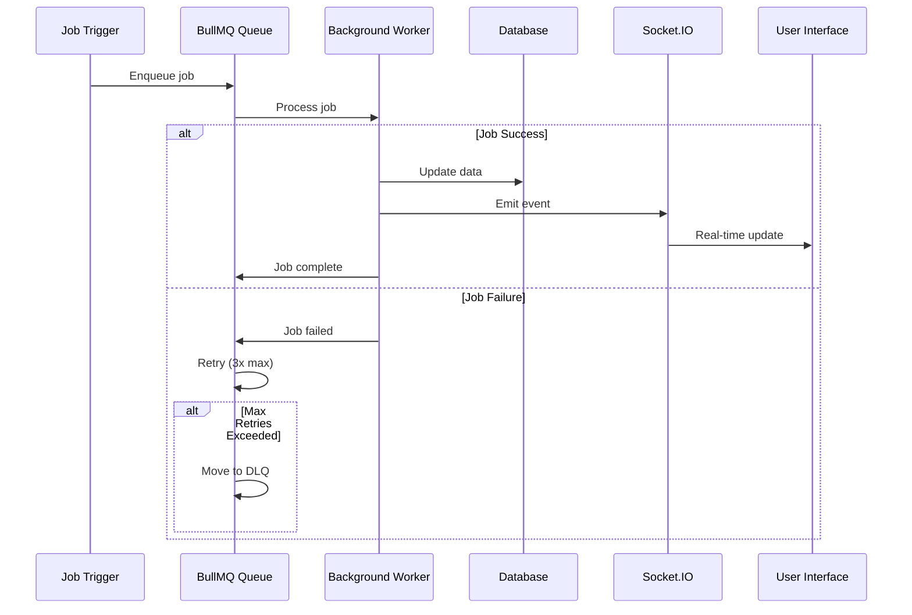
```mermaid
sequenceDiagram
    participant Trigger as Job Trigger
    participant Queue as BullMQ Queue
    participant Worker as Background Worker
    participant DB as Database
    participant Socket as Socket.IO
    participant User as User Interface
    
    Trigger->>Queue: Enqueue job
    Queue->>Worker: Process job
    
    alt Job Success
        Worker->>DB: Update data
        Worker->>Socket: Emit event
        Socket->>User: Real-time update
        Worker->>Queue: Job complete
    else Job Failure
        Worker->>Queue: Job failed
        Queue->>Queue: Retry (3x max)
        alt Max Retries Exceeded
            Queue->>Queue: Move to DLQ
        end
    end
```

**Background Job Features:**
- **Redis-backed Queues**: Reliable job persistence and distribution
- **Automatic Retries**: Configurable retry logic with backoff
- **Dead Letter Queue**: Failed jobs moved to DLQ for investigation
- **Idempotent Jobs**: Jobs can be safely retried without side effects
- **Real-time Updates**: Job results broadcast via Socket.IO

---

## User Experience Flows

### New User Journey
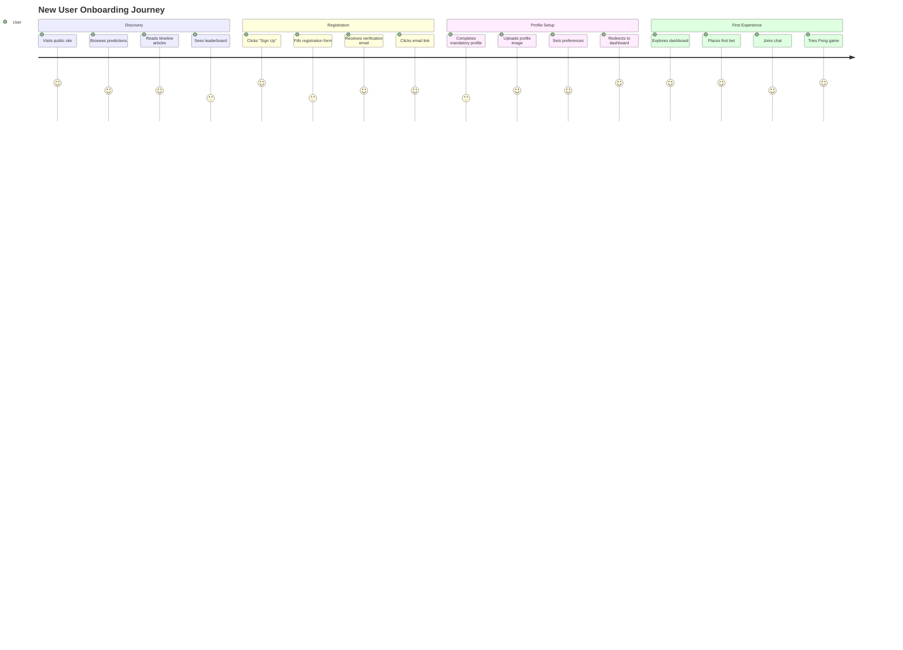
```mermaid
journey
    title New User Onboarding Journey
    section Discovery
      Visits public site: 5: User
      Browses predictions: 4: User
      Reads timeline articles: 4: User
      Sees leaderboard: 3: User
    section Registration
      Clicks "Sign Up": 5: User
      Fills registration form: 3: User
      Receives verification email: 4: User
      Clicks email link: 4: User
    section Profile Setup
      Completes mandatory profile: 3: User
      Uploads profile image: 4: User
      Sets preferences: 4: User
      Redirects to dashboard: 5: User
    section First Experience
      Explores dashboard: 5: User
      Places first bet: 5: User
      Joins chat: 4: User
      Tries Pong game: 5: User
```

### Prediction Market Flow
```mermaid
journey
    title Prediction Market Experience
    section Market Discovery
      Browses predictions: 4: User
      Reads prediction details: 5: User
      Checks current odds: 4: User
      Reviews betting history: 3: User
    section Betting Process
      Selects prediction option: 5: User
      Enters bet amount: 4: User
      Confirms transaction: 4: User
      Receives confirmation: 5: User
    section Market Tracking
      Watches odds changes: 4: User
      Sees real-time activity: 5: User
      Tracks personal bets: 4: User
      Receives resolution notification: 5: User
    section Payout Experience
      Receives winning notification: 5: User
      Sees balance update: 5: User
      Views transaction history: 3: User
      Places next bet: 5: User
```

### Pong Game Flow
```mermaid
journey
    title Pong Gaming Experience
    section Game Discovery
      Visits Pong lobby: 5: User
      Sees active games: 4: User
      Checks leaderboard: 3: User
      Reviews ELO rating: 4: User
    section Game Setup
      Creates new game: 5: User
      Sets wager amount: 4: User
      Waits for opponent: 3: User
      Game starts: 5: User
    section Gameplay
      Controls paddle: 5: User
      Sees real-time physics: 5: User
      Tracks score: 4: User
      Experiences smooth gameplay: 5: User
    section Game Completion
      Game ends: 4: User
      Receives payout: 5: User
      ELO rating updates: 4: User
      Views game history: 3: User
```

### Admin Moderation Flow
```mermaid
journey
    title Admin Moderation Experience
    section Queue Review
      Opens moderation queue: 4: Admin
      Reviews pending articles: 3: Admin
      Uses keyboard shortcuts: 5: Admin
      Performs bulk actions: 4: Admin
    section Content Decision
      Reads article content: 3: Admin
      Checks source credibility: 4: Admin
      Makes approval decision: 4: Admin
      Adds moderation notes: 3: Admin
    section System Monitoring
      Checks system metrics: 4: Admin
      Reviews feed health: 3: Admin
      Monitors user activity: 4: Admin
      Handles system alerts: 3: Admin
    section User Management
      Reviews user reports: 3: Admin
      Investigates violations: 4: Admin
      Takes moderation action: 4: Admin
      Updates shame wall: 2: Admin
```

---

## Performance & Scaling Architecture

```mermaid
graph TB
    %% Load Balancing
    subgraph "Load Balancing Layer"
        CDN[🌐 CDN<br/>Static Assets]
        LoadBalancer[⚖️ Load Balancer<br/>Traffic Distribution]
    end
    
    %% Application Scaling
    subgraph "Horizontal Scaling"
        SSRInstance1[📄 SSR Instance 1]
        SSRInstance2[📄 SSR Instance 2]
        ClientInstance1[💻 Client Instance 1]
        ClientInstance2[💻 Client Instance 2]
        APIInstance1[🔌 API Instance 1]
        APIInstance2[🔌 API Instance 2]
        PongInstance1[🏓 Pong Instance 1]
        PongInstance2[🏓 Pong Instance 2]
    end
    
    %% Data Layer Scaling
    subgraph "Data Layer"
        PGPrimary[(🗄️ PostgreSQL Primary)]
        PGReplica[(📖 PostgreSQL Read Replica)]
        RedisCluster[(⚡ Redis Cluster<br/>Distributed Cache)]
        S3Storage[(📁 S3 Storage<br/>Multi-region)]
    end
    
    %% Monitoring & Observability
    subgraph "Monitoring"
        Metrics[📊 Metrics Collection]
        Logging[📝 Centralized Logging]
        Alerts[🚨 Alert System]
        Tracing[🔍 Distributed Tracing]
    end
    
    %% Traffic Flow
    CDN --> LoadBalancer
    LoadBalancer --> SSRInstance1
    LoadBalancer --> SSRInstance2
    LoadBalancer --> ClientInstance1
    LoadBalancer --> ClientInstance2
    
    SSRInstance1 --> APIInstance1
    SSRInstance2 --> APIInstance2
    ClientInstance1 --> APIInstance1
    ClientInstance2 --> APIInstance2
    
    ClientInstance1 --> PongInstance1
    ClientInstance2 --> PongInstance2
    
    %% Data Connections
    APIInstance1 --> PGPrimary
    APIInstance2 --> PGReplica
    APIInstance1 --> RedisCluster
    APIInstance2 --> RedisCluster
    
    PongInstance1 --> RedisCluster
    PongInstance2 --> RedisCluster
    
    %% Storage
    APIInstance1 --> S3Storage
    APIInstance2 --> S3Storage
    
    %% Monitoring Integration
    SSRInstance1 --> Metrics
    APIInstance1 --> Logging
    PongInstance1 --> Alerts
    RedisCluster --> Tracing
```

**Scaling Strategy:**
- **Horizontal Scaling**: Multiple instances of each service
- **Database Replication**: Read replicas for scaling database reads
- **Redis Clustering**: Distributed caching and pub/sub
- **CDN Integration**: Global content distribution
- **Auto-scaling**: Dynamic instance scaling based on load

---

This comprehensive system architecture document provides visual representations of all major systems and data flows within the ElonMuskSucks.net platform. Each diagram shows how components interact, data flows through the system, and users experience the various features of the dual-application architecture.