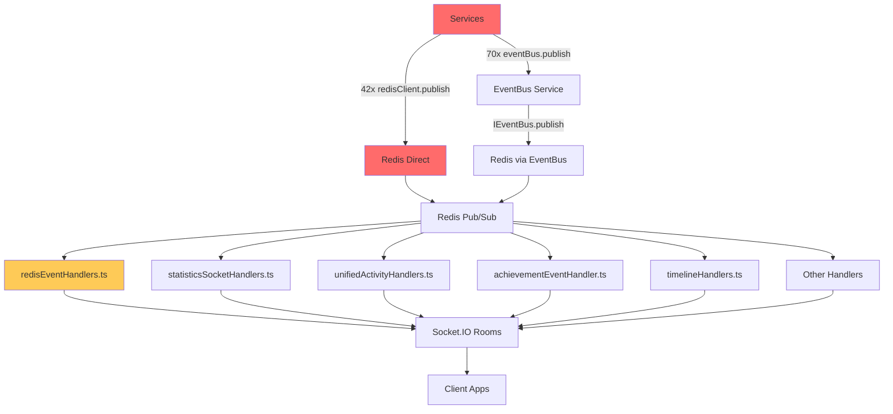

# Phase 0: Event System Audit & Unification Plan

## Executive Summary

This document maps the complete event chaos in the backend system and provides a detailed unification plan. The event system is **severely fragmented** with multiple parallel publishing systems, inconsistent naming, and missing centralized management.

## Audit Results

### 🚨 **CRITICAL FINDINGS**

1. **112+ Event Publishing Points**: 42 direct Redis publishes + 70+ eventBus publishes
2. **80+ Unique Event Channels**: Scattered across services without central registry
3. **Multiple Event Bus Systems**: 3+ parallel systems operating independently
4. **Type System Chaos**: 4+ overlapping socket event constants, 3+ activity type systems
5. **No Single Source of Truth**: Events defined across multiple files with conflicts

---

## 1. Redis Publishing Analysis

### Direct Redis Publish Calls (42 instances)
**Critical Issue**: Services bypassing the event bus system

#### By Service Category:

**Handlers (20 instances):**
```typescript
// statisticsSocketHandlers.ts - 4 calls
'stats:update', 'ranking:change', 'achievement:unlocked', 'stats:refresh'

// chatHandlers.ts - 7 calls  
'chat:message', 'chat:stopTyping', 'chat:typing', 'chat:usersOnline'

// postHandlers.ts - 6 calls
'post:created', 'post:updated', 'post:deleted', 'comment:created', 'comment:deleted', 'post:reaction'

// pongSocketHandlers.ts - 4 calls
'pong:elo:update', 'pong:stats:update', 'pong:tier:change', 'pong:leaderboard:update'
```

**Services (13 instances):**
```typescript
// enhancedUserStats.service.ts - 3 calls
'stats:update', 'stats:refresh', 'ranking:change'

// admin.service.ts - 4 calls
'prediction:approved', 'prediction:resolved', 'admin:moderation:bulk', 'admin:feed:refresh'

// predictions.service.ts - 1 call
'prediction:create'

// payout.service.ts - 1 call
'prediction:resolve'

// unifiedActivity.service.ts - 1 call
'unified:activity:global'

// moderation.service.ts - 1 call
'moderation:userBan', 'moderation:userMute', etc.
```

**Repositories (4 instances):**
```typescript
// PayoutRepository.ts - 4 calls
'bet:status_change', 'parlay:status_change', 'user:stats_update'
```

**Workers (5 instances):**
```typescript
// leaderboard.worker.ts - 3 calls
'leaderboard:allTime', 'leaderboard:daily', 'leaderboard:rank:update'

// payout.worker.ts - 2 calls
'prediction:resolve', 'payout:completed'
```

---

## 2. EventBus Publishing Analysis

### EventBus Publish Calls (70+ instances)
**Better Pattern**: Using the injected IEventBus interface

#### Top Event Publishers:

**EventCorrelator.service.ts (7 calls):**
```typescript
'event:sequence:completed', 'pattern:matched', 'achievement:statistical:anomaly', 
'achievement:probability:defier', 'achievement:yolo:all:in', 'achievement:galaxy:brain:parlay', 
'achievement:pong:comeback'
```

**FinancialTracker.service.ts (8 calls):**
```typescript
'balance:milestone:reached', 'bankruptcy:detected', 'rags:to:riches', 'massive:loss:detected',
'massive:gain:detected', 'comeback:detected', 'profit:snapshot:daily'
```

**betting.service.ts (10 calls):**
```typescript
'bet:place', 'bet:placed', 'parlay:place', 'parlay:placed', 'odds:update:enhanced',
'activity:speed:burst', 'activity:time:pattern', 'user:activity:log'
```

**predictions.service.ts (7 calls):**
```typescript
'prediction:created', 'prediction:viewed', 'user:activity:log', 'prediction:first:correct:bet',
'prediction:resolved:fast', 'prediction:viral'
```

**pongStats.service.ts (3 calls):**
```typescript
'user:activity:log', 'pong:match:completed', 'pong:match:lost', 'pong:elo:milestone'
```

---

## 3. Redis Subscription Analysis

### Active Subscriptions by Handler:

**statisticsSocketHandlers.ts:**
- Subscribes: `'stats:update', 'ranking:change', 'achievement:unlocked', 'stats:refresh'`

**unifiedActivityHandlers.ts:**
- Subscribes: `'unified:activity:global'`

**activityStreamHandlers.ts:**
- Subscribes: `'activity:personal', 'activity:global'`

**timelineHandlers.ts:**
- Subscribes: `'feed:article:approved', 'feed:article:rejected', 'feed:article:new', 'feed:tweet:new', 'feed:tweet:hidden', 'feed:source:created', 'feed:source:updated', 'feed:source:deleted'`

**achievementEventHandler.ts:**
- Subscribes: All achievement channels (50+ channels)

**redisEventHandlers.ts:**
- Subscribes: All REDIS_CHANNELS + extended channels

---

## 4. Event Type Chaos Analysis

### Socket Event Constants (4+ Systems)

**1. SocketEvents (packages/types)**
```typescript
export const SocketEvents = {
  BetPlace: 'bet:place',
  BetPlaced: 'betPlaced',
  StatsUpdate: 'stats:update',
  ActivityUpdate: 'unified:activity:update',
  // ... 20+ more
}
```

**2. StatsSocketEvents (packages/types)**
```typescript
export const StatsSocketEvents = {
  StatsUpdate: 'stats:update',      // DUPLICATE!
  RankingUpdate: 'ranking:update',
  AchievementUnlock: 'achievement:unlock',
  // ... overlaps with SocketEvents
}
```

**3. AdminSocketEvents (packages/types)**
```typescript
export const AdminSocketEvents = {
  ModerationUserBan: 'adminModerationUserBan',
  MetricsUpdate: 'admin:metrics:update',
  // ... admin-specific events
}
```

**4. SocketEvent enum (packages/types)**
```typescript
export enum SocketEvent {
  PREDICTION_CREATED = 'predictionCreated',  // Different naming!
  BET_PLACED = 'betPlaced',
  // ... conflicts with constants above
}
```

### Activity Event Types (3+ Systems)

**1. ActivityEventType constants**
```typescript
export const ActivityEventType = {
  BET_PLACED: 'bet_placed',
  PREDICTION_CREATED: 'prediction_created',
  // ... 10 types
}
```

**2. UnifiedActivityEvent.type union**
```typescript
type: ActivityEventType | 'live_bet' | 'big_bet_alert' | 'achievement_unlocked' | 'user_followed'
// Extends ActivityEventType but inconsistent naming
```

**3. ActivityEventData.type (generic string)**
```typescript
interface ActivityEventData {
  type: string;  // No type safety!
}
```

### Redis Channel Constants

**REDIS_CHANNELS (packages/types) - Only 12 channels defined:**
```typescript
export const REDIS_CHANNELS = {
  PREDICTION_CREATE: 'prediction:create',
  BET_PLACE: 'bet:place',
  STATS_UPDATE: 'stats:update',
  ACHIEVEMENT_UNLOCKED: 'achievement:unlocked',
  // ... only 12 total
}
```

**But 80+ channels are actually used!**

---

## 5. Channel Usage Mapping

### Complete Channel Inventory

#### **Achievement Channels (20+ channels)**
```
achievement:galaxy:brain:parlay, achievement:pong:comeback, achievement:probability:defier,
achievement:statistical:anomaly, achievement:yolo:all:in, achievement:unlocked
```

#### **Activity Channels (15+ channels)**
```
activity:global, activity:personal, activity:speed:burst, activity:time:pattern,
unified:activity:global, unified:activity:update, unified:activity:response
```

#### **Betting Channels (10+ channels)**
```
bet:place, bet:placed, bet:status_change, bet:won, bet:lost,
parlay:place, parlay:placed, parlay:status_change
```

#### **Chat Channels (8+ channels)**
```
chat:message, chat:typing, chat:stopTyping, chat:usersOnline,
chat:message:sent, chat:typing:start, chat:typing:stop
```

#### **Pong Channels (8+ channels)**
```
pong:elo:update, pong:tier:change, pong:stats:update, pong:leaderboard:update,
pong:match:completed, pong:match:lost, pong:elo:milestone
```

#### **Stats Channels (6+ channels)**
```
stats:update, stats:refresh, ranking:change, user:stats_update,
user:balance:snapshot
```

#### **Prediction Channels (10+ channels)**
```
prediction:create, prediction:created, prediction:resolve, prediction:resolved,
prediction:approved, prediction:viewed, prediction:first:correct:bet,
prediction:resolved:fast, prediction:viral
```

#### **Timeline/Feed Channels (12+ channels)**
```
feed:article:approved, feed:article:rejected, feed:article:new,
feed:tweet:new, feed:tweet:hidden, feed:source:created,
feed:source:updated, feed:source:deleted, timeline:articles:new
```

#### **Admin Channels (8+ channels)**
```
admin:metrics:update, admin:moderation:bulk, admin:feed:refresh,
moderation:userBan, moderation:userMute, moderation:messageDelete
```

#### **Financial Channels (8+ channels)**
```
balance:milestone:reached, bankruptcy:detected, rags:to:riches,
massive:loss:detected, massive:gain:detected, comeback:detected,
profit:snapshot:daily
```

#### **User Activity Channels (8+ channels)**
```
user:activity:log, user:daily:login, user:weekend:login,
user:followed, user:balance:snapshot
```

#### **Other Channels (10+ channels)**
```
odds:update:enhanced, payout:completed, leaderboard:allTime,
leaderboard:daily, leaderboard:rank:update, leaderboard:position:reached,
event:sequence:completed, pattern:matched, streak:updated, streak:broken
```

---

## 6. Critical Issues Identified

### 6.1 Publisher/Subscriber Mismatches

**Orphaned Publishers** (Published but not subscribed):
```
activity:speed:burst, activity:time:pattern, balance:milestone:reached,
bankruptcy:detected, rags:to:riches, massive:loss:detected, massive:gain:detected,
comeback:detected, profit:snapshot:daily, event:sequence:completed, pattern:matched
```

**Orphaned Subscribers** (Subscribed but never published):
```
activity:personal, activity:global (activityStreamHandlers subscribes but nothing publishes)
```

### 6.2 Naming Inconsistencies

**Snake_case vs kebab-case:**
```
// Snake case (ActivityEventType)
'bet_placed', 'prediction_created'

// Kebab case (Redis channels)
'bet:placed', 'prediction:created'
```

**Socket event naming conflicts:**
```
// SocketEvents vs SocketEvent enum
SocketEvents.BetPlaced = 'betPlaced'
SocketEvent.BET_PLACED = 'betPlaced'  // Same value, different constant
```

### 6.3 Type Safety Issues

**String-based event types:**
```typescript
// No type safety
interface ActivityEventData {
  type: string;  // Could be anything!
}

// vs typed approach
type ActivityEventType = 'bet_placed' | 'prediction_created' | ...;
```

**Missing channel definitions:**
```typescript
// Only 12 channels defined in REDIS_CHANNELS
// But 80+ channels actually used
// = 68+ undefined channels without type safety
```

---

## 7. Event Flow Diagram



**Problems Identified:**
- **Red**: Direct Redis usage bypasses event bus
- **Yellow**: Handlers listen to undefined channels
- **Missing**: No central event registry or type safety

---

## 8. Unification Plan

### Phase 1A: Channel Registry Consolidation

**Goal**: Single source of truth for all event channels

**1. Extend REDIS_CHANNELS in packages/types:**
```typescript
export const REDIS_CHANNELS = {
  // Existing channels (keep as-is)
  PREDICTION_CREATE: 'prediction:create',
  BET_PLACE: 'bet:place',
  
  // Add missing channels (80+ channels to add)
  
  // Achievement channels
  ACHIEVEMENT_STATISTICAL_ANOMALY: 'achievement:statistical:anomaly',
  ACHIEVEMENT_PROBABILITY_DEFIER: 'achievement:probability:defier',
  ACHIEVEMENT_YOLO_ALL_IN: 'achievement:yolo:all:in',
  ACHIEVEMENT_GALAXY_BRAIN_PARLAY: 'achievement:galaxy:brain:parlay',
  ACHIEVEMENT_PONG_COMEBACK: 'achievement:pong:comeback',
  
  // Activity channels
  UNIFIED_ACTIVITY_GLOBAL: 'unified:activity:global',
  UNIFIED_ACTIVITY_UPDATE: 'unified:activity:update',
  ACTIVITY_SPEED_BURST: 'activity:speed:burst',
  ACTIVITY_TIME_PATTERN: 'activity:time:pattern',
  
  // Financial channels
  BALANCE_MILESTONE_REACHED: 'balance:milestone:reached',
  BANKRUPTCY_DETECTED: 'bankruptcy:detected',
  RAGS_TO_RICHES: 'rags:to:riches',
  MASSIVE_LOSS_DETECTED: 'massive:loss:detected',
  MASSIVE_GAIN_DETECTED: 'massive:gain:detected',
  COMEBACK_DETECTED: 'comeback:detected',
  PROFIT_SNAPSHOT_DAILY: 'profit:snapshot:daily',
  
  // Chat channels
  CHAT_MESSAGE: 'chat:message',
  CHAT_TYPING: 'chat:typing',
  CHAT_STOP_TYPING: 'chat:stopTyping',
  CHAT_USERS_ONLINE: 'chat:usersOnline',
  CHAT_MESSAGE_SENT: 'chat:message:sent',
  CHAT_TYPING_START: 'chat:typing:start',
  CHAT_TYPING_STOP: 'chat:typing:stop',
  
  // Pong channels
  PONG_ELO_UPDATE: 'pong:elo:update',
  PONG_TIER_CHANGE: 'pong:tier:change',
  PONG_STATS_UPDATE: 'pong:stats:update',
  PONG_LEADERBOARD_UPDATE: 'pong:leaderboard:update',
  PONG_MATCH_COMPLETED: 'pong:match:completed',
  PONG_MATCH_LOST: 'pong:match:lost',
  PONG_ELO_MILESTONE: 'pong:elo:milestone',
  
  // User activity channels
  USER_ACTIVITY_LOG: 'user:activity:log',
  USER_DAILY_LOGIN: 'user:daily:login',
  USER_WEEKEND_LOGIN: 'user:weekend:login',
  USER_BALANCE_SNAPSHOT: 'user:balance:snapshot',
  USER_STATS_UPDATE: 'user:stats_update',
  
  // Prediction channels
  PREDICTION_CREATED: 'prediction:created',
  PREDICTION_VIEWED: 'prediction:viewed',
  PREDICTION_APPROVED: 'prediction:approved',
  PREDICTION_RESOLVED_FAST: 'prediction:resolved:fast',
  PREDICTION_VIRAL: 'prediction:viral',
  PREDICTION_FIRST_CORRECT_BET: 'prediction:first:correct:bet',
  
  // Betting channels
  BET_PLACED: 'bet:placed',
  BET_STATUS_CHANGE: 'bet:status_change',
  BET_WON: 'bet:won',
  BET_LOST: 'bet:lost',
  PARLAY_PLACED: 'parlay:placed',
  PARLAY_STATUS_CHANGE: 'parlay:status_change',
  
  // Timeline channels
  FEED_ARTICLE_APPROVED: 'feed:article:approved',
  FEED_ARTICLE_REJECTED: 'feed:article:rejected',
  FEED_ARTICLE_NEW: 'feed:article:new',
  FEED_TWEET_NEW: 'feed:tweet:new',
  FEED_TWEET_HIDDEN: 'feed:tweet:hidden',
  FEED_SOURCE_CREATED: 'feed:source:created',
  FEED_SOURCE_UPDATED: 'feed:source:updated',
  FEED_SOURCE_DELETED: 'feed:source:deleted',
  TIMELINE_ARTICLES_NEW: 'timeline:articles:new',
  
  // Admin channels
  ADMIN_METRICS_UPDATE: 'admin:metrics:update',
  ADMIN_MODERATION_BULK: 'admin:moderation:bulk',
  ADMIN_FEED_REFRESH: 'admin:feed:refresh',
  MODERATION_USER_BAN: 'moderation:userBan',
  MODERATION_USER_MUTE: 'moderation:userMute',
  MODERATION_MESSAGE_DELETE: 'moderation:messageDelete',
  
  // Leaderboard channels
  LEADERBOARD_ALL_TIME: 'leaderboard:allTime',
  LEADERBOARD_DAILY: 'leaderboard:daily',
  LEADERBOARD_RANK_UPDATE: 'leaderboard:rank:update',
  LEADERBOARD_POSITION_REACHED: 'leaderboard:position:reached',
  LEADERBOARD_COMEBACK_MAJOR: 'leaderboard:comeback:major',
  LEADERBOARD_COMEBACK_MODERATE: 'leaderboard:comeback:moderate',
  
  // Streak channels
  STREAK_UPDATED: 'streak:updated',
  STREAK_BROKEN: 'streak:broken',
  STREAK_RESET: 'streak:reset',
  STREAK_MILESTONE_REACHED: 'streak:milestone:reached',
  
  // Other channels
  ODDS_UPDATE_ENHANCED: 'odds:update:enhanced',
  PAYOUT_COMPLETED: 'payout:completed',
  EVENT_SEQUENCE_COMPLETED: 'event:sequence:completed',
  PATTERN_MATCHED: 'pattern:matched',
  EMOJI_USED: 'emoji:used',
  THREAD_PARTICIPATION: 'thread:participation',
} as const;
```

**2. Remove conflicting socket event constants:**
- Merge `SocketEvents`, `StatsSocketEvents`, `AdminSocketEvents` into single system
- Remove `SocketEvent` enum (conflicts with constants)
- Use only `REDIS_CHANNELS` for all event names

### Phase 1B: Direct Redis Publishing Elimination

**Goal**: All publishing goes through eventBus interface

**Migration pattern for each service:**
```typescript
// Before (direct Redis)
await redisClient.publish('stats:update', JSON.stringify(payload));

// After (event bus)
await this.eventBus.publish(REDIS_CHANNELS.STATS_UPDATE, payload);
```

**Services to migrate (42 instances):**

1. **statisticsSocketHandlers.ts** (4 calls)
2. **chatHandlers.ts** (7 calls)  
3. **postHandlers.ts** (6 calls)
4. **pongSocketHandlers.ts** (4 calls)
5. **enhancedUserStats.service.ts** (3 calls)
6. **admin.service.ts** (4 calls)
7. **PayoutRepository.ts** (4 calls)
8. **predictions.service.ts** (1 call)
9. **payout.service.ts** (1 call)
10. **unifiedActivity.service.ts** (1 call)
11. **moderation.service.ts** (variable calls)
12. **leaderboard.worker.ts** (3 calls)
13. **payout.worker.ts** (2 calls)
14. **feed.worker.ts** (variable calls)

### Phase 1C: Activity Event Type Unification

**Goal**: Single activity event type system

**1. Standardize on ActivityEventType constants:**
```typescript
export const ActivityEventType = {
  BET_PLACED: 'bet_placed',
  PREDICTION_CREATED: 'prediction_created',
  PARLAY_STARTED: 'parlay_started',
  PREDICTION_RESOLVED: 'prediction_resolved',
  POST_CREATED: 'post_created',
  COMMENT_CREATED: 'comment_created',
  ACHIEVEMENT_UNLOCKED: 'achievement_unlocked',  // Add missing types
  BIG_WIN: 'big_win',
  USER_FOLLOWED: 'user_followed',
  // ... standardize all activity types
} as const;
```

**2. Remove conflicting type systems:**
- `UnifiedActivityEvent.type` union → use ActivityEventType only
- `ActivityEventData.type` string → use ActivityEventType only
- `ActivityStreamEntry.type` string → use ActivityEventType only

**3. Update all activity creation calls:**
```typescript
// Before (string literals)
await unifiedActivity.publishActivity({
  type: 'bet_placed',  // String literal
  // ...
});

// After (typed constants)
await unifiedActivity.publishActivity({
  type: ActivityEventType.BET_PLACED,  // Type-safe
  // ...
});
```

### Phase 1D: Handler Standardization

**Goal**: All handlers use REDIS_CHANNELS constants

**Update redisEventHandlers.ts:**
```typescript
// Before
case 'stats:update':  // Hardcoded string

// After  
case REDIS_CHANNELS.STATS_UPDATE:  // Type-safe constant
```

**Remove ExtendedRedisChannel type:**
All channels should be defined in REDIS_CHANNELS, no extensions needed.

---

## 9. Implementation Timeline

### Week 1: Channel Registry & Type Safety
- **Day 1-2**: Add all 80+ channels to REDIS_CHANNELS
- **Day 3-4**: Remove conflicting socket event constants  
- **Day 5**: Update handler subscriptions to use constants

### Week 2: Direct Redis Migration
- **Day 1-2**: Migrate services (predictions, admin, payout, moderation)
- **Day 3-4**: Migrate handlers (statistics, chat, post, pong)
- **Day 5**: Migrate repositories and workers

### Week 3: Activity System Unification  
- **Day 1-2**: Standardize ActivityEventType constants
- **Day 3-4**: Remove conflicting activity type systems
- **Day 5**: Update all activity creation calls

### Week 4: Testing & Validation
- **Day 1-2**: Integration testing (event flow end-to-end)
- **Day 3-4**: Performance testing (reduced Redis connections)
- **Day 5**: Production deployment preparation

---

## 10. Success Metrics

### Code Quality Metrics
- [ ] **Zero direct Redis publish calls** (currently 42)
- [ ] **Single REDIS_CHANNELS registry** (currently 12 defined, 80+ used)
- [ ] **Single activity event type system** (currently 3+ systems)
- [ ] **No hardcoded channel strings** (currently 80+ hardcoded)
- [ ] **All handlers use constants** (currently mixed)

### Runtime Metrics  
- [ ] **Reduced Redis connections** (fewer duplicate subscribers)
- [ ] **No orphaned events** (all published channels have subscribers)
- [ ] **Type safety** (compile-time channel validation)
- [ ] **Event flow traceability** (single path for all events)

### Developer Experience
- [ ] **IntelliSense for channels** (typed constants)
- [ ] **Easy event discovery** (single registry file)
- [ ] **Consistent patterns** (same event bus everywhere)
- [ ] **Clear documentation** (event flow diagram)

---

## 11. Risk Mitigation

### High-Risk Changes
1. **Channel name changes**: Could break existing subscriptions
2. **Activity type changes**: Could break client-side event handling  
3. **Redis connection changes**: Could impact real-time features

### Mitigation Strategies
1. **Feature flags**: Toggle between old/new systems
2. **Incremental migration**: One service at a time
3. **Integration tests**: Verify event flow before deployment
4. **Rollback plan**: Keep old system for emergency rollback

### Testing Strategy
```typescript
// Event flow integration test
describe('Event System Integration', () => {
  it('should publish and receive events through unified system', async () => {
    // Publish via eventBus
    await eventBus.publish(REDIS_CHANNELS.BET_PLACED, betData);
    
    // Verify handler receives event
    await waitForEvent('betPlaced');
    
    // Verify client receives socket event
    expect(mockSocket.emit).toHaveBeenCalledWith('betPlaced', betData);
  });
});
```

---

## 12. Next Steps

1. **Review this audit** with team for feedback
2. **Approve unification approach** (eventBus vs direct Redis)
3. **Start Phase 1A**: Channel registry consolidation
4. **Set up feature flags** for gradual migration  
5. **Create integration test suite** for event flow validation

**This audit identifies the event system as the most critical architecture issue requiring immediate attention. The fragmentation impacts real-time features, stats tracking, and overall system reliability.**

---

**Document Version**: 1.0  
**Audit Date**: September 2025  
**Files Analyzed**: 166 TypeScript files  
**Events Mapped**: 112+ publishing points, 80+ unique channels  
**Next Review**: After Phase 1A completion