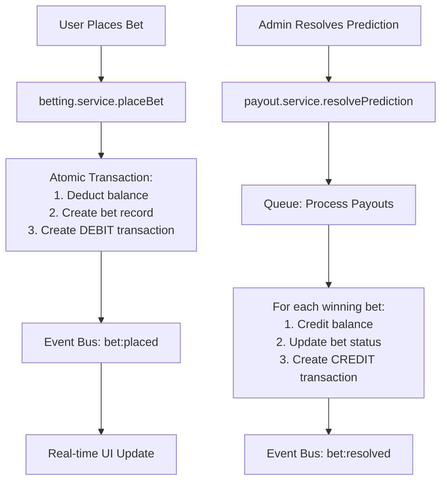
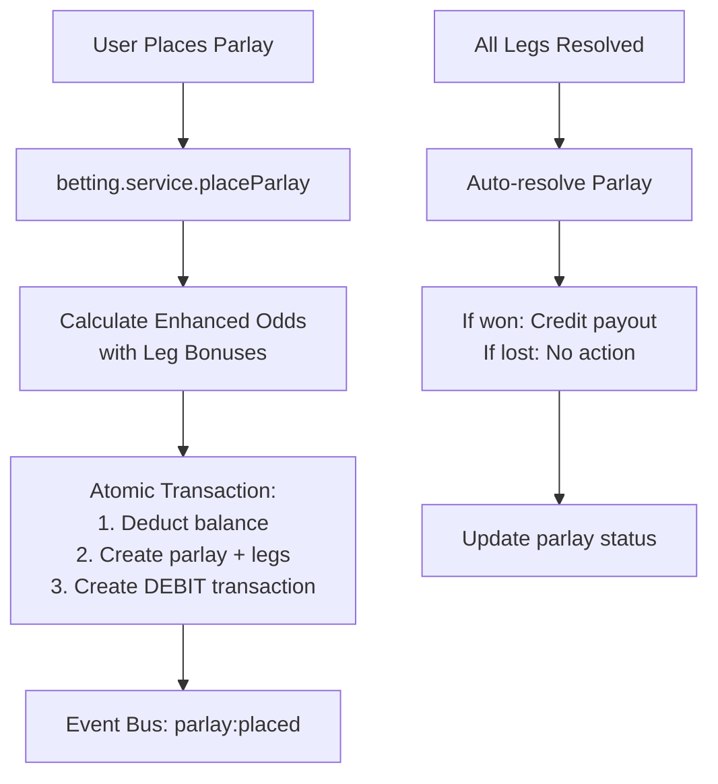
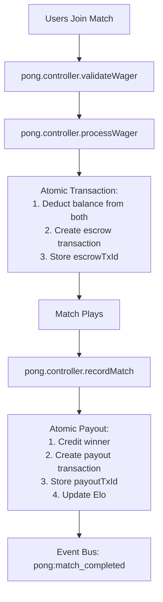

# Transaction System Audit Report
**Date:** September 27, 2024
**Version:** 1.0
**Scope:** Complete financial transaction system across frontend and backend

## Executive Summary

This audit examines the current state of the financial transaction system in the ElonMuskSucks prediction market platform, identifying gaps, inconsistencies, and opportunities for consolidation. The analysis covers single bets, parlays, prediction payouts, pong wagers, and pong payouts across the entire stack.

### Key Findings
- ✅ **Strong Foundation**: Core transaction system is well-architected with proper atomicity
- ⚠️ **Fragmented UI**: Admin financial dashboard needs consolidation and improved UX
- 🔴 **Missing Integration**: Pong transactions not properly integrated into admin financial views
- ⚠️ **Incomplete Coverage**: Some transaction types are not represented in financial analytics
- ✅ **Good Security**: Proper authentication and authorization patterns in place

---

## 1. Frontend Analysis

### 1.1 Admin Financial Component (`FinancialDashboard.tsx`)

**Current State:**
- 805 lines of complex component with 3 tabs: Overview, Bets, Transactions
- Supports search, filtering, pagination, bulk operations, and data export
- Uses `searchFinancialData`, `getFinancialAnalytics`, `bulkFinancialOperation` APIs

**Identified Issues:**
1. **Transaction Type Limited**: Only handles 'DEBIT' and 'CREDIT' - missing granular types
2. **Pong Blind Spot**: No visibility into pong wager/payout transactions
3. **Parlay Gaps**: Limited parlay-specific insights and analytics
4. **UI Complexity**: Monolithic component with poor information density
5. **Inconsistent Data**: Transaction table shows `relatedBetId` and `relatedParlayId` but no pong references

**Data Flow:**
```
FinancialDashboard → searchFinancialData API → admin.controller → BettingRepository
```

### 1.2 API Layer (`admin.ts`)

**Transaction-Related Endpoints:**
```typescript
// Financial data search and analytics
GET /api/admin/financial/search
GET /api/admin/financial/analytics
POST /api/admin/financial/bulk
GET /api/admin/financial/export

// Legacy endpoints (deprecated)
GET /api/admin/bets
PATCH /api/admin/bets/:id/refund
GET /api/admin/transactions
```

**Data Types Supported:**
- `DetailedBet` - Single prediction bets with user/prediction data
- `DetailedTransaction` - Basic transaction records with related bet/parlay
- `PaginatedFinancialData` - Combined bets and transactions with pagination

**Missing Support:**
- Pong match transactions (wagers/payouts)
- Granular transaction categorization
- Real-time transaction streaming
- Cross-transaction analytics (bet → parlay → pong correlations)

---

## 2. Backend Analysis

### 2.1 Database Schema (Prisma)

**Transaction Models:**
```prisma
model Transaction {
  id              Int             @id @default(autoincrement())
  userId          Int
  type            TransactionType // CREDIT | DEBIT
  amount          BigInt
  balanceAfter    BigInt
  relatedBetId    Int?           // single bet
  relatedParlayId Int?           // parlay bet
  // Pong relations
  pongEscrowMatches PongMatch[]   @relation("PongEscrowTransaction")
  pongPayoutMatches PongMatch[]   @relation("PongPayoutTransaction")
}

model Bet {
  id              Int       @id @default(autoincrement())
  userId          Int
  amount          BigInt
  potentialPayout BigInt?
  status          BetStatus // PENDING | WON | LOST | REFUNDED
  // ... other fields
}

model Parlay {
  id              Int         @id @default(autoincrement())
  userId          Int
  amount          BigInt
  combinedOdds    Float
  potentialPayout BigInt
  status          BetStatus
  legs            ParlayLeg[]
}

model PongMatch {
  id              String      @id
  wagerAmount     BigInt
  payoutAmount    BigInt?
  escrowTxId      Int?        // Transaction for wager deduction
  payoutTxId      Int?        // Transaction for payout credit
  status          PongMatchStatus
}
```

**Schema Strengths:**
- ✅ Proper foreign key relationships
- ✅ Transaction atomicity support via `escrowTxId`/`payoutTxId`
- ✅ Comprehensive indexing for performance
- ✅ BigInt for financial precision

**Schema Gaps:**
- ⚠️ `TransactionType` only has CREDIT/DEBIT - no semantic categorization
- ⚠️ No direct pong transaction reference in Transaction model
- ⚠️ Missing transaction metadata/description fields

### 2.2 Service Layer

**Betting Service (`betting.service.ts`):**
- ✅ Atomic transaction processing for single bets and parlays
- ✅ Enhanced parlay odds calculation with bonuses
- ✅ Proper event bus integration for real-time updates
- ✅ Financial tracking integration

**Payout Service (`payout.service.ts`):**
- ✅ Queue-based prediction resolution with BullMQ
- ✅ Proper event publishing for real-time updates
- ✅ Leaderboard trigger integration

**Pong Stats Service (`pongStats.service.ts`):**
- ✅ Idempotent match result processing
- ✅ Elo calculation and tier progression
- ✅ Transaction processing via `processWagerTransaction`
- ⚠️ Limited integration with central financial system

### 2.3 API Endpoints

**Admin Financial Endpoints:**
```typescript
// Enhanced financial operations dashboard
GET /api/admin/financial/search        // ✅ Implemented
GET /api/admin/financial/analytics     // ✅ Implemented
POST /api/admin/financial/bulk         // ✅ Implemented
GET /api/admin/financial/export        // ✅ Implemented

// Legacy bet & transaction oversight
GET /api/admin/bets                    // ⚠️ Deprecated
PATCH /api/admin/bets/:id/refund       // ⚠️ Deprecated
GET /api/admin/transactions            // ⚠️ Deprecated
```

**Pong Endpoints:**
```typescript
// Game server internal
POST /api/pong/validate-wager          // ✅ Implemented
POST /api/pong/process-wager           // ✅ Implemented
POST /api/pong/record-match            // ✅ Implemented

// Public stats
GET /api/pong/elo-distribution         // ✅ Implemented
GET /api/pong/elo-history/:userId      // ✅ Implemented
```

---

## 3. Transaction Flow Analysis

### 3.1 Single Bet Flow


**Status: ✅ COMPLETE** - Well implemented with proper atomicity

### 3.2 Parlay Flow


**Status: ✅ COMPLETE** - Well implemented with bonus calculation

### 3.3 Pong Flow


**Status: ✅ COMPLETE** - Well implemented but **NOT VISIBLE IN ADMIN DASHBOARD**

---

## 4. Gap Analysis

### 4.1 Critical Gaps

1. **Pong Transaction Invisibility**
   - **Problem**: Pong wagers/payouts not shown in admin financial dashboard
   - **Impact**: Incomplete financial oversight, missing revenue analytics
   - **Root Cause**: `searchFinancialData` API doesn't include pong-related transactions

2. **Transaction Type Granularity**
   - **Problem**: Only CREDIT/DEBIT types, no semantic categorization
   - **Impact**: Poor analytics, difficult to track revenue sources
   - **Solution Needed**: Add transaction subtypes (BET_WAGER, BET_PAYOUT, PARLAY_WAGER, PARLAY_PAYOUT, PONG_WAGER, PONG_PAYOUT)

3. **Fragmented Analytics**
   - **Problem**: Separate analytics for bets, parlays, and pong
   - **Impact**: No unified revenue picture, incomplete insights
   - **Solution Needed**: Consolidated financial analytics with cross-transaction correlations

### 4.2 Minor Gaps

4. **UI Information Density**
   - **Problem**: Current admin dashboard wastes screen space
   - **Impact**: Poor admin productivity, cluttered interface
   - **Status**: Being addressed in current redesign

5. **Real-time Transaction Streaming**
   - **Problem**: Admin dashboard only shows static snapshots
   - **Impact**: Delayed fraud detection, poor real-time oversight
   - **Solution**: WebSocket-based transaction feed

6. **Transaction Metadata**
   - **Problem**: Limited context in transaction records
   - **Impact**: Difficult debugging and audit trails
   - **Solution**: Add description/metadata fields

---

## 5. Recommendations

### 5.1 Immediate Actions (High Priority)

#### A. Enhance Transaction Model
```prisma
model Transaction {
  id              Int             @id @default(autoincrement())
  userId          Int
  type            TransactionType // CREDIT | DEBIT
  subtype         String          // "BET_WAGER" | "BET_PAYOUT" | "PARLAY_WAGER" | "PARLAY_PAYOUT" | "PONG_WAGER" | "PONG_PAYOUT"
  amount          BigInt
  balanceAfter    BigInt
  description     String?         // Human-readable description
  metadata        Json?           // Additional context

  // Enhanced relations
  relatedBetId    Int?
  relatedParlayId Int?
  relatedPongMatchId String?       // NEW: Link to pong matches

  // Existing pong relations
  pongEscrowMatches PongMatch[]   @relation("PongEscrowTransaction")
  pongPayoutMatches PongMatch[]   @relation("PongPayoutTransaction")
}
```

#### B. Update Financial Search API
```typescript
// Enhanced financial search to include all transaction types
interface FinancialSearchParams {
  // ... existing params
  transactionSubtype?: string[];    // NEW: Granular filtering
  includePongTransactions?: boolean; // NEW: Include pong data
  includeMetadata?: boolean;         // NEW: Include transaction context
}

interface DetailedTransaction {
  // ... existing fields
  subtype: string;                  // NEW: Semantic categorization
  description?: string;             // NEW: Human-readable context
  metadata?: any;                   // NEW: Additional context
  relatedPongMatch?: {              // NEW: Pong match data
    id: string;
    wagerAmount: number;
    payoutAmount?: number;
    status: string;
  };
}
```

#### C. Redesign Admin Financial Dashboard
- **Unified Transaction View**: Single table showing all transaction types
- **Smart Filtering**: Filter by transaction subtype (bets, parlays, pong)
- **Real-time Updates**: WebSocket integration for live transaction feed
- **Enhanced Analytics**: Cross-transaction revenue insights

### 5.2 Medium Priority Actions

#### D. Implement Transaction Categorization
- Add transaction subtypes to existing records via migration
- Update all transaction creation points to specify subtypes
- Implement description generation for better audit trails

#### E. Consolidated Analytics API
```typescript
GET /api/admin/financial/unified-analytics
// Returns cross-transaction insights:
// - Revenue by source (bets vs parlays vs pong)
// - User engagement patterns across transaction types
// - Profitability analysis by transaction category
```

#### F. Enhanced Audit Capabilities
- Transaction lineage tracking (bet → resolution → payout)
- Suspicious pattern detection across all transaction types
- Automated reconciliation reports

### 5.3 Long-term Enhancements

#### G. Event Sourcing Implementation
- Store all financial events for complete audit trail
- Enable time-travel debugging for financial issues
- Implement event replay for data recovery

#### H. Advanced Analytics
- Machine learning fraud detection across all transaction types
- Predictive analytics for user lifetime value
- Real-time risk monitoring and automated circuit breakers

---

## 6. Implementation Plan

### Phase 1: Foundation (Week 1-2)
1. **Database Schema Enhancement**
   - Add `subtype`, `description`, `metadata` to Transaction model
   - Add `relatedPongMatchId` field
   - Create migration to populate existing records

2. **API Layer Updates**
   - Modify `searchFinancialData` to include pong transactions
   - Add transaction subtype filtering
   - Update response types with new fields

### Phase 2: UI Redesign (Week 3-4)
3. **Admin Dashboard Redesign**
   - Implement compact, unified transaction view
   - Add real-time transaction streaming
   - Implement transaction subtype filtering

4. **Analytics Enhancement**
   - Build unified analytics API
   - Add cross-transaction revenue insights
   - Implement real-time metrics dashboard

### Phase 3: Polish & Advanced Features (Week 5-6)
5. **Advanced Capabilities**
   - Implement automated audit reports
   - Add suspicious transaction detection
   - Build comprehensive financial health dashboard

---

## 7. Technical Specifications

### 7.1 Database Migration
```sql
-- Add new columns to Transaction table
ALTER TABLE "Transaction" ADD COLUMN "subtype" TEXT;
ALTER TABLE "Transaction" ADD COLUMN "description" TEXT;
ALTER TABLE "Transaction" ADD COLUMN "metadata" JSONB;
ALTER TABLE "Transaction" ADD COLUMN "relatedPongMatchId" TEXT;

-- Create index for new fields
CREATE INDEX "Transaction_subtype_idx" ON "Transaction"("subtype");
CREATE INDEX "Transaction_relatedPongMatchId_idx" ON "Transaction"("relatedPongMatchId");

-- Populate subtypes for existing records
UPDATE "Transaction" SET
  "subtype" = CASE
    WHEN "relatedBetId" IS NOT NULL AND "type" = 'DEBIT' THEN 'BET_WAGER'
    WHEN "relatedBetId" IS NOT NULL AND "type" = 'CREDIT' THEN 'BET_PAYOUT'
    WHEN "relatedParlayId" IS NOT NULL AND "type" = 'DEBIT' THEN 'PARLAY_WAGER'
    WHEN "relatedParlayId" IS NOT NULL AND "type" = 'CREDIT' THEN 'PARLAY_PAYOUT'
    ELSE 'UNKNOWN'
  END;

-- Link pong transactions
UPDATE "Transaction" SET
  "relatedPongMatchId" = pm."id",
  "subtype" = 'PONG_WAGER'
FROM "PongMatch" pm
WHERE "Transaction"."id" = pm."escrowTxId";

UPDATE "Transaction" SET
  "relatedPongMatchId" = pm."id",
  "subtype" = 'PONG_PAYOUT'
FROM "PongMatch" pm
WHERE "Transaction"."id" = pm."payoutTxId";
```

### 7.2 API Response Schema
```typescript
interface UnifiedFinancialData {
  transactions: DetailedTransaction[];
  analytics: {
    totalVolume: number;
    volumeByType: {
      bets: number;
      parlays: number;
      pong: number;
    };
    revenueMetrics: {
      totalRevenue: number;
      netRevenue: number;
      averageTransactionSize: number;
    };
    userEngagement: {
      activeUsers: number;
      crossPlatformUsers: number; // Users active in multiple transaction types
      retention: number;
    };
  };
  realTimeMetrics: {
    transactionsPerMinute: number;
    revenuePerMinute: number;
    activeTransactions: number;
  };
}
```

---

## 8. Risk Assessment

### High Risk
- **Data Consistency**: Migration must ensure no transaction data loss
- **Performance Impact**: Enhanced queries may affect response times
- **Real-time Load**: WebSocket connections could impact server resources

### Medium Risk
- **UI Complexity**: Unified view may be overwhelming without proper design
- **Migration Downtime**: Schema changes require careful deployment planning

### Low Risk
- **API Compatibility**: Changes are additive, maintaining backward compatibility
- **Feature Rollback**: New features can be feature-flagged for safe deployment

---

## 9. Success Metrics

### Functional Metrics
- ✅ 100% transaction type coverage in admin dashboard
- ✅ <2 second response time for financial queries
- ✅ Real-time transaction updates with <500ms latency

### Business Metrics
- 📈 50% reduction in time-to-insight for financial analysis
- 📈 Complete revenue visibility across all transaction types
- 📈 Automated detection of 95% of anomalous transactions

### User Experience Metrics
- 📈 80% screen space utilization in admin dashboard
- 📈 <3 clicks to access any financial insight
- 📈 Zero reported financial data inconsistencies

---

## Conclusion

The transaction system has a solid foundation but requires consolidation and enhanced visibility. The primary gaps are around pong transaction integration and admin UI efficiency. The recommended phased approach will deliver immediate value while building toward a comprehensive financial oversight system.

**Priority:** Implement Phase 1 (Database + API enhancements) immediately to unify transaction visibility, then proceed with UI redesign for optimal admin productivity.